```mermaid
graph LR
    Cell_Annotation["Cell Annotation"]
    Cell_Query["Cell Query"]
    KNN_Search_Core["KNN Search Core"]
    Cell_Embedding_Model["Cell Embedding Model"]
    Ontology_Management["Ontology Management"]
    Data_Utilities["Data Utilities"]
    NN_Models["NN Models"]
    Training_Models["Training Models"]
    Triplet_Selector["Triplet Selector"]
    Cell_Annotation -- "uses" --> KNN_Search_Core
    Cell_Annotation -- "obtains embeddings from" --> Cell_Embedding_Model
    Cell_Annotation -- "utilizes" --> Data_Utilities
    Cell_Annotation -- "configured by" --> Ontology_Management
    Cell_Query -- "uses" --> KNN_Search_Core
    Cell_Query -- "obtains embeddings from" --> Cell_Embedding_Model
    Cell_Query -- "utilizes" --> Data_Utilities
    KNN_Search_Core -- "uses" --> Cell_Embedding_Model
    Cell_Embedding_Model -- "uses" --> NN_Models
    Ontology_Management -- "provides data to" --> Cell_Annotation
    Ontology_Management -- "used by" --> Triplet_Selector
    Data_Utilities -- "utilized by" --> Cell_Annotation
    Data_Utilities -- "utilized by" --> Cell_Query
    NN_Models -- "used by" --> Cell_Embedding_Model
    NN_Models -- "used by" --> Training_Models
    Training_Models -- "uses" --> NN_Models
    Training_Models -- "uses" --> Triplet_Selector
    Triplet_Selector -- "uses" --> Ontology_Management
    Triplet_Selector -- "used by" --> Training_Models
```

## Component Details

This component offers high-level functionalities for annotating cells by leveraging cell embeddings and KNN search to predict cell types, and provides various methods for querying cells based on their embeddings.

### Cell Annotation
This component is responsible for annotating cells using cell embeddings and kNN search. It allows for blocklisting and safelisting cell types to refine annotation results and provides methods to get predictions and annotate entire datasets.

**Related Classes/Methods**:

- <a href="https://github.com/Genentech/scimilarity/blob/master/src/scimilarity/cell_annotation.py#L6-L319" target="_blank" rel="noopener noreferrer">`scimilarity.cell_annotation.CellAnnotation` (6:319)</a>
- <a href="https://github.com/Genentech/scimilarity/blob/master/src/scimilarity/cell_annotation.py#L23-L66" target="_blank" rel="noopener noreferrer">`scimilarity.src.scimilarity.cell_annotation.CellAnnotation:__init__` (23:66)</a>
- <a href="https://github.com/Genentech/scimilarity/blob/master/src/scimilarity/cell_annotation.py#L118-L146" target="_blank" rel="noopener noreferrer">`scimilarity.src.scimilarity.cell_annotation.CellAnnotation:safelist_celltypes` (118:146)</a>
- <a href="https://github.com/Genentech/scimilarity/blob/master/src/scimilarity/cell_annotation.py#L92-L116" target="_blank" rel="noopener noreferrer">`scimilarity.src.scimilarity.cell_annotation.CellAnnotation:blocklist_celltypes` (92:116)</a>
- <a href="https://github.com/Genentech/scimilarity/blob/master/src/scimilarity/cell_annotation.py#L148-L279" target="_blank" rel="noopener noreferrer">`scimilarity.src.scimilarity.cell_annotation.CellAnnotation:get_predictions_knn` (148:279)</a>
- <a href="https://github.com/Genentech/scimilarity/blob/master/src/scimilarity/cell_annotation.py#L281-L319" target="_blank" rel="noopener noreferrer">`scimilarity.src.scimilarity.cell_annotation.CellAnnotation:annotate_dataset` (281:319)</a>
- <a href="https://github.com/Genentech/scimilarity/blob/master/src/scimilarity/cell_annotation.py#L74-L90" target="_blank" rel="noopener noreferrer">`scimilarity.src.scimilarity.cell_annotation.CellAnnotation.reset_knn` (74:90)</a>

### Cell Query
This component provides various methods for searching similar cells based on embeddings. It supports both nearest neighbor and exhaustive search strategies, including searches for individual cells, centroids of marked cells, and cluster centroids. It manages cell metadata and precomputed embeddings.

**Related Classes/Methods**:

- <a href="https://github.com/Genentech/scimilarity/blob/master/src/scimilarity/cell_query.py#L6-L743" target="_blank" rel="noopener noreferrer">`scimilarity.cell_query.CellQuery` (6:743)</a>
- <a href="https://github.com/Genentech/scimilarity/blob/master/src/scimilarity/cell_query.py#L31-L91" target="_blank" rel="noopener noreferrer">`scimilarity.src.scimilarity.cell_query.CellQuery:__init__` (31:91)</a>
- <a href="https://github.com/Genentech/scimilarity/blob/master/src/scimilarity/cell_query.py#L93-L115" target="_blank" rel="noopener noreferrer">`scimilarity.src.scimilarity.cell_query.CellQuery:get_precomputed_embeddings` (93:115)</a>
- <a href="https://github.com/Genentech/scimilarity/blob/master/src/scimilarity/cell_query.py#L206-L275" target="_blank" rel="noopener noreferrer">`scimilarity.src.scimilarity.cell_query.CellQuery:search_nearest` (206:275)</a>
- <a href="https://github.com/Genentech/scimilarity/blob/master/src/scimilarity/cell_query.py#L277-L375" target="_blank" rel="noopener noreferrer">`scimilarity.src.scimilarity.cell_query.CellQuery:search_centroid_nearest` (277:375)</a>
- <a href="https://github.com/Genentech/scimilarity/blob/master/src/scimilarity/cell_query.py#L377-L473" target="_blank" rel="noopener noreferrer">`scimilarity.src.scimilarity.cell_query.CellQuery:search_cluster_centroids_nearest` (377:473)</a>
- <a href="https://github.com/Genentech/scimilarity/blob/master/src/scimilarity/cell_query.py#L475-L559" target="_blank" rel="noopener noreferrer">`scimilarity.src.scimilarity.cell_query.CellQuery:search_exhaustive` (475:559)</a>
- <a href="https://github.com/Genentech/scimilarity/blob/master/src/scimilarity/cell_query.py#L561-L652" target="_blank" rel="noopener noreferrer">`scimilarity.src.scimilarity.cell_query.CellQuery:search_centroid_exhaustive` (561:652)</a>
- <a href="https://github.com/Genentech/scimilarity/blob/master/src/scimilarity/cell_query.py#L654-L743" target="_blank" rel="noopener noreferrer">`scimilarity.src.scimilarity.cell_query.CellQuery:search_cluster_centroids_exhaustive` (654:743)</a>

### KNN Search Core
This component provides the fundamental k-nearest neighbors search capabilities. It handles loading different types of kNN indexes and executing nearest neighbor queries against cell embeddings.

**Related Classes/Methods**:

- <a href="https://github.com/Genentech/scimilarity/blob/master/src/scimilarity/cell_search_knn.py#L6-L103" target="_blank" rel="noopener noreferrer">`scimilarity.src.scimilarity.cell_search_knn.CellSearchKNN` (6:103)</a>
- <a href="https://github.com/Genentech/scimilarity/blob/master/src/scimilarity/cell_search_knn.py#L23-L38" target="_blank" rel="noopener noreferrer">`scimilarity.src.scimilarity.cell_search_knn.CellSearchKNN.__init__` (23:38)</a>
- <a href="https://github.com/Genentech/scimilarity/blob/master/src/scimilarity/cell_search_knn.py#L40-L62" target="_blank" rel="noopener noreferrer">`scimilarity.src.scimilarity.cell_search_knn.CellSearchKNN.load_knn_index` (40:62)</a>
- <a href="https://github.com/Genentech/scimilarity/blob/master/src/scimilarity/cell_search_knn.py#L64-L103" target="_blank" rel="noopener noreferrer">`scimilarity.src.scimilarity.cell_search_knn.CellSearchKNN.get_nearest_neighbors` (64:103)</a>

### Cell Embedding Model
This component is responsible for generating numerical embeddings from cell gene expression data using a pre-trained machine learning model. It loads the model, gene order, and handles GPU acceleration if available.

**Related Classes/Methods**:

- <a href="https://github.com/Genentech/scimilarity/blob/master/src/scimilarity/cell_embedding.py#L4-L156" target="_blank" rel="noopener noreferrer">`scimilarity.src.scimilarity.cell_embedding.CellEmbedding` (4:156)</a>
- <a href="https://github.com/Genentech/scimilarity/blob/master/src/scimilarity/cell_embedding.py#L19-L70" target="_blank" rel="noopener noreferrer">`scimilarity.src.scimilarity.cell_embedding.CellEmbedding.__init__` (19:70)</a>
- <a href="https://github.com/Genentech/scimilarity/blob/master/src/scimilarity/cell_embedding.py#L72-L156" target="_blank" rel="noopener noreferrer">`scimilarity.src.scimilarity.cell_embedding.CellEmbedding.get_embeddings` (72:156)</a>

### Ontology Management
This component is responsible for importing and managing various biological ontologies (Cell Ontology, UBERON, DOID, MONDO). It provides functionalities to extract information from these ontologies, such as ID to name mappings, and is instrumental in building and preparing metadata for cell search and annotation processes, as demonstrated by its use in the 'build_cellsearch_metadata' script.

**Related Classes/Methods**:

- <a href="https://github.com/Genentech/scimilarity/blob/master/src/scimilarity/ontologies.py#L30-L51" target="_blank" rel="noopener noreferrer">`scimilarity.ontologies.import_cell_ontology` (30:51)</a>
- <a href="https://github.com/Genentech/scimilarity/blob/master/src/scimilarity/ontologies.py#L126-L144" target="_blank" rel="noopener noreferrer">`scimilarity.ontologies.get_id_mapper` (126:144)</a>
- <a href="https://github.com/Genentech/scimilarity/blob/master/src/scimilarity/ontologies.py#L7-L27" target="_blank" rel="noopener noreferrer">`scimilarity.ontologies.subset_nodes_to_set` (7:27)</a>
- <a href="https://github.com/Genentech/scimilarity/blob/master/src/scimilarity/ontologies.py#L54-L75" target="_blank" rel="noopener noreferrer">`scimilarity.ontologies.import_uberon_ontology` (54:75)</a>
- <a href="https://github.com/Genentech/scimilarity/blob/master/src/scimilarity/ontologies.py#L78-L99" target="_blank" rel="noopener noreferrer">`scimilarity.ontologies.import_doid_ontology` (78:99)</a>
- <a href="https://github.com/Genentech/scimilarity/blob/master/src/scimilarity/ontologies.py#L102-L123" target="_blank" rel="noopener noreferrer">`scimilarity.ontologies.import_mondo_ontology` (102:123)</a>
- <a href="https://github.com/Genentech/scimilarity/blob/master/src/scimilarity/ontologies.py#L147-L172" target="_blank" rel="noopener noreferrer">`scimilarity.ontologies.get_children` (147:172)</a>
- <a href="https://github.com/Genentech/scimilarity/blob/master/src/scimilarity/ontologies.py#L175-L200" target="_blank" rel="noopener noreferrer">`scimilarity.ontologies.get_parents` (175:200)</a>
- <a href="https://github.com/Genentech/scimilarity/blob/master/src/scimilarity/ontologies.py#L203-L231" target="_blank" rel="noopener noreferrer">`scimilarity.ontologies.get_siblings` (203:231)</a>
- <a href="https://github.com/Genentech/scimilarity/blob/master/src/scimilarity/ontologies.py#L234-L264" target="_blank" rel="noopener noreferrer">`scimilarity.ontologies.get_all_ancestors` (234:264)</a>
- <a href="https://github.com/Genentech/scimilarity/blob/master/src/scimilarity/ontologies.py#L267-L301" target="_blank" rel="noopener noreferrer">`scimilarity.ontologies.get_all_descendants` (267:301)</a>
- <a href="https://github.com/Genentech/scimilarity/blob/master/src/scimilarity/ontologies.py#L304-L328" target="_blank" rel="noopener noreferrer">`scimilarity.ontologies.get_lowest_common_ancestor` (304:328)</a>
- <a href="https://github.com/Genentech/scimilarity/blob/master/src/scimilarity/ontologies.py#L331-L369" target="_blank" rel="noopener noreferrer">`scimilarity.ontologies.find_most_viable_parent` (331:369)</a>
- <a href="https://github.com/Genentech/scimilarity/blob/master/src/scimilarity/ontologies.py#L372-L401" target="_blank" rel="noopener noreferrer">`scimilarity.ontologies.ontology_similarity` (372:401)</a>
- <a href="https://github.com/Genentech/scimilarity/blob/master/src/scimilarity/ontologies.py#L404-L436" target="_blank" rel="noopener noreferrer">`scimilarity.ontologies.all_pair_similarities` (404:436)</a>
- <a href="https://github.com/Genentech/scimilarity/blob/master/src/scimilarity/ontologies.py#L439-L517" target="_blank" rel="noopener noreferrer">`scimilarity.ontologies.ontology_silhouette_width` (439:517)</a>
- <a href="https://github.com/Genentech/scimilarity/blob/master/scripts/build_cellsearch_metadata.py#L15-L118" target="_blank" rel="noopener noreferrer">`scimilarity.scripts.build_cellsearch_metadata:main` (15:118)</a>

### Data Utilities
This component contains a collection of general-purpose helper functions used across the 'scimilarity' library. These include functions for handling embeddings from TileDB, calculating centroids, aligning datasets, and cleaning tissue and disease names.

**Related Classes/Methods**:

- `scimilarity.src.scimilarity.utils.embedding_from_tiledb` (full file reference)
- `scimilarity.src.scimilarity.utils.get_centroid` (full file reference)
- `scimilarity.src.scimilarity.utils.get_cluster_centroids` (full file reference)
- `scimilarity.src.scimilarity.utils.align_dataset` (full file reference)

### NN Models
This component encapsulates the neural network models, specifically the encoder and decoder architectures, used for generating cell embeddings and potentially for other machine learning tasks within the scimilarity library.

**Related Classes/Methods**:

- <a href="https://github.com/Genentech/scimilarity/blob/master/src/scimilarity/nn_models.py#L12-L110" target="_blank" rel="noopener noreferrer">`scimilarity.nn_models.Encoder` (12:110)</a>
- <a href="https://github.com/Genentech/scimilarity/blob/master/src/scimilarity/nn_models.py#L113-L206" target="_blank" rel="noopener noreferrer">`scimilarity.nn_models.Decoder` (113:206)</a>

### Training Models
This component provides functionalities for training machine learning models, specifically focusing on metric learning, which is crucial for learning effective cell embeddings. It leverages neural network architectures and triplet loss for training.

**Related Classes/Methods**:

- <a href="https://github.com/Genentech/scimilarity/blob/master/src/scimilarity/training_models.py#L15-L686" target="_blank" rel="noopener noreferrer">`scimilarity.training_models.MetricLearning` (15:686)</a>

### Triplet Selector
This component is responsible for selecting triplets (anchor, positive, negative samples) for metric learning, and calculating triplet loss. It leverages ontology information to guide the triplet selection process, ensuring biologically meaningful relationships are considered during model training.

**Related Classes/Methods**:

- <a href="https://github.com/Genentech/scimilarity/blob/master/src/scimilarity/triplet_selector.py#L357-L436" target="_blank" rel="noopener noreferrer">`scimilarity.triplet_selector.TripletLoss` (357:436)</a>
- <a href="https://github.com/Genentech/scimilarity/blob/master/src/scimilarity/triplet_selector.py#L17-L354" target="_blank" rel="noopener noreferrer">`scimilarity.triplet_selector.TripletSelector` (17:354)</a>

### [FAQ](https://github.com/CodeBoarding/GeneratedOnBoardings/tree/main?tab=readme-ov-file#faq)