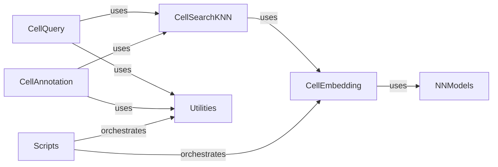

## Component Details

The Cell Embedding & Search subsystem is responsible for generating numerical representations (embeddings) of cells using a trained neural network encoder and providing K-Nearest Neighbors (KNN) search capabilities for efficient retrieval of similar cells. It encompasses components for embedding generation, neural network models, KNN search, cell querying, cell annotation, and utility functions, orchestrated by various scripts.

### CellEmbedding
The CellEmbedding component is responsible for loading a pre-trained neural network model (Encoder) and using it to calculate embeddings for cell gene expression data. It handles model initialization, loading of gene order and layer sizes, and the actual embedding computation, supporting both CPU and GPU usage.

**Related Classes/Methods**:

- <a href="https://github.com/Genentech/scimilarity/blob/master/src/scimilarity/cell_embedding.py#L4-L156" target="_blank" rel="noopener noreferrer">`scimilarity.cell_embedding.CellEmbedding` (4:156)</a>
- <a href="https://github.com/Genentech/scimilarity/blob/master/src/scimilarity/cell_embedding.py#L19-L70" target="_blank" rel="noopener noreferrer">`scimilarity.src.scimilarity.cell_embedding.CellEmbedding:__init__` (19:70)</a>
- <a href="https://github.com/Genentech/scimilarity/blob/master/src/scimilarity/cell_embedding.py#L72-L156" target="_blank" rel="noopener noreferrer">`scimilarity.src.scimilarity.cell_embedding.CellEmbedding:get_embeddings` (72:156)</a>

### NNModels
The NNModels component, specifically the Encoder class, represents the neural network architecture used for generating cell embeddings. It provides functionality to load the pre-trained state of the model.

**Related Classes/Methods**:

- <a href="https://github.com/Genentech/scimilarity/blob/master/src/scimilarity/nn_models.py#L12-L110" target="_blank" rel="noopener noreferrer">`scimilarity.nn_models.Encoder` (12:110)</a>
- <a href="https://github.com/Genentech/scimilarity/blob/master/src/scimilarity/nn_models.py#L93-L110" target="_blank" rel="noopener noreferrer">`scimilarity.nn_models.Encoder.load_state` (93:110)</a>

### CellSearchKNN
The CellSearchKNN component manages the K-Nearest Neighbors (KNN) search functionality. It is responsible for loading a pre-built KNN index and performing nearest neighbor queries on cell embeddings. It also uses CellEmbedding to generate embeddings for query cells if needed.

**Related Classes/Methods**:

- <a href="https://github.com/Genentech/scimilarity/blob/master/src/scimilarity/cell_search_knn.py#L6-L103" target="_blank" rel="noopener noreferrer">`scimilarity.cell_search_knn.CellSearchKNN` (6:103)</a>
- <a href="https://github.com/Genentech/scimilarity/blob/master/src/scimilarity/cell_search_knn.py#L23-L38" target="_blank" rel="noopener noreferrer">`scimilarity.src.scimilarity.cell_search_knn.CellSearchKNN:__init__` (23:38)</a>
- <a href="https://github.com/Genentech/scimilarity/blob/master/src/scimilarity/cell_search_knn.py#L40-L62" target="_blank" rel="noopener noreferrer">`scimilarity.src.scimilarity.cell_search_knn.CellSearchKNN.load_knn_index` (40:62)</a>
- <a href="https://github.com/Genentech/scimilarity/blob/master/src/scimilarity/cell_search_knn.py#L64-L103" target="_blank" rel="noopener noreferrer">`scimilarity.src.scimilarity.cell_search_knn.CellSearchKNN.get_nearest_neighbors` (64:103)</a>

### CellQuery
The CellQuery component provides various methods for querying cell datasets based on similarity. It leverages CellSearchKNN for nearest neighbor searches and implicitly CellEmbedding for generating embeddings, supporting searches for individual cells, centroids, and cluster centroids, with both nearest and exhaustive search options.

**Related Classes/Methods**:

- <a href="https://github.com/Genentech/scimilarity/blob/master/src/scimilarity/cell_query.py#L6-L743" target="_blank" rel="noopener noreferrer">`scimilarity.cell_query.CellQuery` (6:743)</a>
- <a href="https://github.com/Genentech/scimilarity/blob/master/src/scimilarity/cell_query.py#L31-L91" target="_blank" rel="noopener noreferrer">`scimilarity.cell_query.CellQuery.__init__` (31:91)</a>
- <a href="https://github.com/Genentech/scimilarity/blob/master/src/scimilarity/cell_query.py#L206-L275" target="_blank" rel="noopener noreferrer">`scimilarity.cell_query.CellQuery.search_nearest` (206:275)</a>
- <a href="https://github.com/Genentech/scimilarity/blob/master/src/scimilarity/cell_query.py#L277-L375" target="_blank" rel="noopener noreferrer">`scimilarity.cell_query.CellQuery.search_centroid_nearest` (277:375)</a>
- <a href="https://github.com/Genentech/scimilarity/blob/master/src/scimilarity/cell_query.py#L377-L473" target="_blank" rel="noopener noreferrer">`scimilarity.cell_query.CellQuery.search_cluster_centroids_nearest` (377:473)</a>
- <a href="https://github.com/Genentech/scimilarity/blob/master/src/scimilarity/cell_query.py#L475-L559" target="_blank" rel="noopener noreferrer">`scimilarity.cell_query.CellQuery.search_exhaustive` (475:559)</a>
- <a href="https://github.com/Genentech/scimilarity/blob/master/src/scimilarity/cell_query.py#L561-L652" target="_blank" rel="noopener noreferrer">`scimilarity.cell_query.CellQuery.search_centroid_exhaustive` (561:652)</a>
- <a href="https://github.com/Genentech/scimilarity/blob/master/src/scimilarity/cell_query.py#L654-L743" target="_blank" rel="noopener noreferrer">`scimilarity.cell_query.CellQuery.search_cluster_centroids_exhaustive` (654:743)</a>

### CellAnnotation
The CellAnnotation component is designed for annotating cell datasets. It uses CellSearchKNN to find nearest neighbors, which are then used to predict cell types or labels for a given dataset, implicitly leveraging CellEmbedding for the initial embedding generation.

**Related Classes/Methods**:

- <a href="https://github.com/Genentech/scimilarity/blob/master/src/scimilarity/cell_annotation.py#L6-L319" target="_blank" rel="noopener noreferrer">`scimilarity.cell_annotation.CellAnnotation` (6:319)</a>
- <a href="https://github.com/Genentech/scimilarity/blob/master/src/scimilarity/cell_annotation.py#L23-L66" target="_blank" rel="noopener noreferrer">`scimilarity.cell_annotation.CellAnnotation.__init__` (23:66)</a>
- <a href="https://github.com/Genentech/scimilarity/blob/master/src/scimilarity/cell_annotation.py#L148-L279" target="_blank" rel="noopener noreferrer">`scimilarity.cell_annotation.CellAnnotation.get_predictions_knn` (148:279)</a>
- <a href="https://github.com/Genentech/scimilarity/blob/master/src/scimilarity/cell_annotation.py#L281-L319" target="_blank" rel="noopener noreferrer">`scimilarity.cell_annotation.CellAnnotation.annotate_dataset` (281:319)</a>

### Utilities
The Utilities component provides helper functions for data manipulation and optimization within the scimilarity ecosystem. This includes functions for optimizing TileDB arrays, calculating centroids, getting cluster centroids, and aligning datasets.

**Related Classes/Methods**:

- `scimilarity.utils.optimize_tiledb_array` (full file reference)
- `scimilarity.utils.get_centroid` (full file reference)
- `scimilarity.utils.get_cluster_centroids` (full file reference)
- `scimilarity.utils.align_dataset` (full file reference)

### Scripts
The Scripts component contains the main entry points for various scimilarity functionalities, such as building embeddings. It orchestrates the use of other components like CellEmbedding and Utilities to perform high-level tasks.

**Related Classes/Methods**:

- <a href="https://github.com/Genentech/scimilarity/blob/master/scripts/build_embeddings.py#L41-L119" target="_blank" rel="noopener noreferrer">`scimilarity.scripts.build_embeddings:main` (41:119)</a>
- <a href="https://github.com/Genentech/scimilarity/blob/master/scripts/build_embeddings.py#L19-L39" target="_blank" rel="noopener noreferrer">`scimilarity.scripts.build_embeddings.get_expression` (19:39)</a>

### [FAQ](https://github.com/CodeBoarding/GeneratedOnBoardings/tree/main?tab=readme-ov-file#faq)