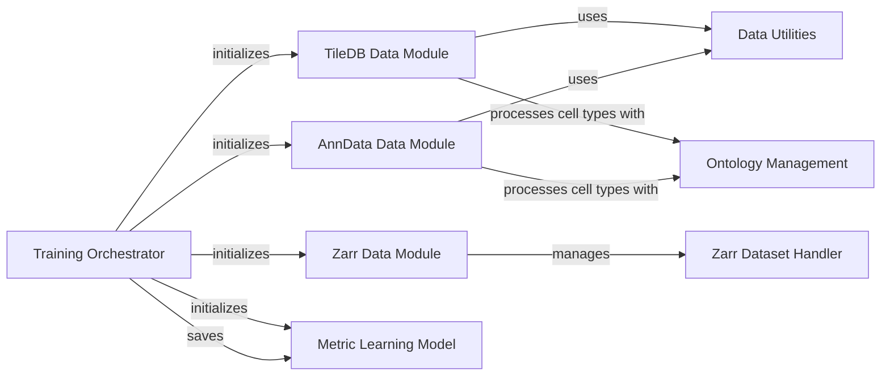

## Component Details

This graph illustrates the architecture of the scimilarity project, focusing on the data management and training workflow. The core functionality revolves around loading and preprocessing single-cell data from various formats (TileDB, Zarr, AnnData) and feeding it into a Metric Learning Model for training. The Training Orchestrator component acts as the central coordinator, initializing and managing the data modules and the training process. Specialized data modules handle format-specific data loading and preprocessing, while a dedicated Zarr Dataset Handler provides low-level access to Zarr-formatted data. Additionally, Ontology Management and Data Utilities components provide supporting functionalities for cell type harmonization and general data manipulation.

### Training Orchestrator
This component manages the overall training workflow, including argument parsing, environment setup, initialization of data modules and the metric learning model, and execution of the training and testing phases using PyTorch Lightning.

**Related Classes/Methods**:

- <a href="https://github.com/Genentech/scimilarity/blob/master/scripts/train.py#L64-L229" target="_blank" rel="noopener noreferrer">`scimilarity.scripts.train:train` (64:229)</a>
- <a href="https://github.com/Genentech/scimilarity/blob/master/scripts/train.py#L232-L261" target="_blank" rel="noopener noreferrer">`scimilarity.scripts.train:main` (232:261)</a>

### TileDB Data Module
Responsible for loading, filtering, and preparing single-cell gene expression data from TileDB arrays for training and validation. It handles cell type harmonization, singleton label removal, and provides data loaders.

**Related Classes/Methods**:

- <a href="https://github.com/Genentech/scimilarity/blob/master/src/scimilarity/tiledb_data_models.py#L121-L631" target="_blank" rel="noopener noreferrer">`scimilarity.tiledb_data_models.CellMultisetDataModule` (121:631)</a>
- <a href="https://github.com/Genentech/scimilarity/blob/master/src/scimilarity/tiledb_data_models.py#L186-L363" target="_blank" rel="noopener noreferrer">`scimilarity.src.scimilarity.tiledb_data_models.CellMultisetDataModule:__init__` (186:363)</a>
- <a href="https://github.com/Genentech/scimilarity/blob/master/src/scimilarity/tiledb_data_models.py#L368-L382" target="_blank" rel="noopener noreferrer">`scimilarity.src.scimilarity.tiledb_data_models.CellMultisetDataModule:get_data` (368:382)</a>
- <a href="https://github.com/Genentech/scimilarity/blob/master/src/scimilarity/tiledb_data_models.py#L496-L525" target="_blank" rel="noopener noreferrer">`scimilarity.src.scimilarity.tiledb_data_models.CellMultisetDataModule:harmonize_cell_types` (496:525)</a>
- <a href="https://github.com/Genentech/scimilarity/blob/master/src/scimilarity/tiledb_data_models.py#L399-L447" target="_blank" rel="noopener noreferrer">`scimilarity.src.scimilarity.tiledb_data_models.CellMultisetDataModule:remove_singleton_label_ids` (399:447)</a>
- <a href="https://github.com/Genentech/scimilarity/blob/master/src/scimilarity/tiledb_data_models.py#L384-L397" target="_blank" rel="noopener noreferrer">`scimilarity.src.scimilarity.tiledb_data_models.CellMultisetDataModule:map_cell_type_id2name` (384:397)</a>
- <a href="https://github.com/Genentech/scimilarity/blob/master/src/scimilarity/tiledb_data_models.py#L572-L594" target="_blank" rel="noopener noreferrer">`scimilarity.src.scimilarity.tiledb_data_models.CellMultisetDataModule:train_dataloader` (572:594)</a>
- <a href="https://github.com/Genentech/scimilarity/blob/master/src/scimilarity/tiledb_data_models.py#L596-L620" target="_blank" rel="noopener noreferrer">`scimilarity.src.scimilarity.tiledb_data_models.CellMultisetDataModule:val_dataloader` (596:620)</a>
- <a href="https://github.com/Genentech/scimilarity/blob/master/src/scimilarity/tiledb_data_models.py#L622-L631" target="_blank" rel="noopener noreferrer">`scimilarity.src.scimilarity.tiledb_data_models.CellMultisetDataModule:test_dataloader` (622:631)</a>
- <a href="https://github.com/Genentech/scimilarity/blob/master/src/scimilarity/tiledb_data_models.py#L61-L118" target="_blank" rel="noopener noreferrer">`scimilarity.src.scimilarity.tiledb_data_models.CellSampler` (61:118)</a>
- <a href="https://github.com/Genentech/scimilarity/blob/master/src/scimilarity/tiledb_data_models.py#L39-L58" target="_blank" rel="noopener noreferrer">`scimilarity.src.scimilarity.tiledb_data_models.scDataset` (39:58)</a>

### Zarr Data Module
Manages the loading and preparation of single-cell data stored in Zarr format. It initializes Zarr datasets and provides data loaders for training, validation, and testing, including methods for sampler weight calculation.

**Related Classes/Methods**:

- <a href="https://github.com/Genentech/scimilarity/blob/master/src/scimilarity/zarr_data_models.py#L54-L284" target="_blank" rel="noopener noreferrer">`scimilarity.zarr_data_models.MetricLearningDataModule` (54:284)</a>
- <a href="https://github.com/Genentech/scimilarity/blob/master/src/scimilarity/zarr_data_models.py#L88-L173" target="_blank" rel="noopener noreferrer">`scimilarity.src.scimilarity.zarr_data_models.MetricLearningDataModule:__init__` (88:173)</a>
- <a href="https://github.com/Genentech/scimilarity/blob/master/src/scimilarity/zarr_data_models.py#L235-L252" target="_blank" rel="noopener noreferrer">`scimilarity.src.scimilarity.zarr_data_models.MetricLearningDataModule:train_dataloader` (235:252)</a>
- <a href="https://github.com/Genentech/scimilarity/blob/master/src/scimilarity/zarr_data_models.py#L254-L273" target="_blank" rel="noopener noreferrer">`scimilarity.src.scimilarity.zarr_data_models.MetricLearningDataModule:val_dataloader` (254:273)</a>
- <a href="https://github.com/Genentech/scimilarity/blob/master/src/scimilarity/zarr_data_models.py#L275-L284" target="_blank" rel="noopener noreferrer">`scimilarity.src.scimilarity.zarr_data_models.MetricLearningDataModule:test_dataloader` (275:284)</a>
- <a href="https://github.com/Genentech/scimilarity/blob/master/src/scimilarity/zarr_data_models.py#L175-L209" target="_blank" rel="noopener noreferrer">`scimilarity.src.scimilarity.zarr_data_models.MetricLearningDataModule.get_sampler_weights` (175:209)</a>
- <a href="https://github.com/Genentech/scimilarity/blob/master/src/scimilarity/zarr_data_models.py#L13-L51" target="_blank" rel="noopener noreferrer">`scimilarity.src.scimilarity.zarr_data_models.scDataset` (13:51)</a>

### AnnData Data Module
Handles the loading and preprocessing of single-cell data from AnnData objects. It includes functionalities for subsetting valid terms, aligning datasets, and providing data loaders for different training phases.

**Related Classes/Methods**:

- <a href="https://github.com/Genentech/scimilarity/blob/master/src/scimilarity/anndata_data_models.py#L39-L262" target="_blank" rel="noopener noreferrer">`scimilarity.anndata_data_models.MetricLearningDataModule` (39:262)</a>
- <a href="https://github.com/Genentech/scimilarity/blob/master/src/scimilarity/anndata_data_models.py#L68-L131" target="_blank" rel="noopener noreferrer">`scimilarity.src.scimilarity.anndata_data_models.MetricLearningDataModule:__init__` (68:131)</a>
- <a href="https://github.com/Genentech/scimilarity/blob/master/src/scimilarity/anndata_data_models.py#L213-L230" target="_blank" rel="noopener noreferrer">`scimilarity.src.scimilarity.anndata_data_models.MetricLearningDataModule:train_dataloader` (213:230)</a>
- <a href="https://github.com/Genentech/scimilarity/blob/master/src/scimilarity/anndata_data_models.py#L232-L251" target="_blank" rel="noopener noreferrer">`scimilarity.src.scimilarity.anndata_data_models.MetricLearningDataModule:val_dataloader` (232:251)</a>
- <a href="https://github.com/Genentech/scimilarity/blob/master/src/scimilarity/anndata_data_models.py#L253-L262" target="_blank" rel="noopener noreferrer">`scimilarity.src.scimilarity.anndata_data_models.MetricLearningDataModule:test_dataloader` (253:262)</a>
- <a href="https://github.com/Genentech/scimilarity/blob/master/src/scimilarity/anndata_data_models.py#L133-L151" target="_blank" rel="noopener noreferrer">`scimilarity.src.scimilarity.anndata_data_models.MetricLearningDataModule.subset_valid_terms` (133:151)</a>
- <a href="https://github.com/Genentech/scimilarity/blob/master/src/scimilarity/anndata_data_models.py#L153-L187" target="_blank" rel="noopener noreferrer">`scimilarity.src.scimilarity.anndata_data_models.MetricLearningDataModule.get_sampler_weights` (153:187)</a>
- <a href="https://github.com/Genentech/scimilarity/blob/master/src/scimilarity/anndata_data_models.py#L13-L36" target="_blank" rel="noopener noreferrer">`scimilarity.src.scimilarity.anndata_data_models.scDataset` (13:36)</a>

### Metric Learning Model
Implements the core neural network model for learning cell embeddings. It processes input data to generate latent representations and uses metric learning objectives (e.g., triplet loss) to optimize these embeddings. It also provides methods for saving the trained model.

**Related Classes/Methods**:

- <a href="https://github.com/Genentech/scimilarity/blob/master/src/scimilarity/training_models.py#L15-L686" target="_blank" rel="noopener noreferrer">`scimilarity.training_models.MetricLearning` (15:686)</a>
- <a href="https://github.com/Genentech/scimilarity/blob/master/src/scimilarity/training_models.py#L566-L638" target="_blank" rel="noopener noreferrer">`scimilarity.training_models.MetricLearning.save_all` (566:638)</a>

### Zarr Dataset Handler
Provides a low-level API for accessing and manipulating single-cell data stored in Zarr arrays. It supports operations like retrieving gene expression matrices, annotations, and slicing data by rows or columns.

**Related Classes/Methods**:

- <a href="https://github.com/Genentech/scimilarity/blob/master/src/scimilarity/zarr_dataset.py#L12-L999" target="_blank" rel="noopener noreferrer">`scimilarity.src.scimilarity.zarr_dataset.ZarrDataset` (12:999)</a>
- <a href="https://github.com/Genentech/scimilarity/blob/master/src/scimilarity/zarr_dataset.py#L83-L98" target="_blank" rel="noopener noreferrer">`scimilarity.src.scimilarity.zarr_dataset.ZarrDataset:var_index` (83:98)</a>
- <a href="https://github.com/Genentech/scimilarity/blob/master/src/scimilarity/zarr_dataset.py#L101-L122" target="_blank" rel="noopener noreferrer">`scimilarity.src.scimilarity.zarr_dataset.ZarrDataset:var` (101:122)</a>
- <a href="https://github.com/Genentech/scimilarity/blob/master/src/scimilarity/zarr_dataset.py#L125-L140" target="_blank" rel="noopener noreferrer">`scimilarity.src.scimilarity.zarr_dataset.ZarrDataset:obs_index` (125:140)</a>
- <a href="https://github.com/Genentech/scimilarity/blob/master/src/scimilarity/zarr_dataset.py#L143-L164" target="_blank" rel="noopener noreferrer">`scimilarity.src.scimilarity.zarr_dataset.ZarrDataset:obs` (143:164)</a>
- <a href="https://github.com/Genentech/scimilarity/blob/master/src/scimilarity/zarr_dataset.py#L166-L187" target="_blank" rel="noopener noreferrer">`scimilarity.src.scimilarity.zarr_dataset.ZarrDataset:get_X` (166:187)</a>
- <a href="https://github.com/Genentech/scimilarity/blob/master/src/scimilarity/zarr_dataset.py#L189-L212" target="_blank" rel="noopener noreferrer">`scimilarity.src.scimilarity.zarr_dataset.ZarrDataset:get_counts` (189:212)</a>
- <a href="https://github.com/Genentech/scimilarity/blob/master/src/scimilarity/zarr_dataset.py#L214-L229" target="_blank" rel="noopener noreferrer">`scimilarity.src.scimilarity.zarr_dataset.ZarrDataset:set_X` (214:229)</a>
- <a href="https://github.com/Genentech/scimilarity/blob/master/src/scimilarity/zarr_dataset.py#L231-L251" target="_blank" rel="noopener noreferrer">`scimilarity.src.scimilarity.zarr_dataset.ZarrDataset:append_X` (231:251)</a>
- <a href="https://github.com/Genentech/scimilarity/blob/master/src/scimilarity/zarr_dataset.py#L253-L273" target="_blank" rel="noopener noreferrer">`scimilarity.src.scimilarity.zarr_dataset.ZarrDataset:get_var` (253:273)</a>
- <a href="https://github.com/Genentech/scimilarity/blob/master/src/scimilarity/zarr_dataset.py#L275-L295" target="_blank" rel="noopener noreferrer">`scimilarity.src.scimilarity.zarr_dataset.ZarrDataset:get_obs` (275:295)</a>
- <a href="https://github.com/Genentech/scimilarity/blob/master/src/scimilarity/zarr_dataset.py#L321-L349" target="_blank" rel="noopener noreferrer">`scimilarity.src.scimilarity.zarr_dataset.ZarrDataset:get_row` (321:349)</a>
- <a href="https://github.com/Genentech/scimilarity/blob/master/src/scimilarity/zarr_dataset.py#L351-L379" target="_blank" rel="noopener noreferrer">`scimilarity.src.scimilarity.zarr_dataset.ZarrDataset:get_col` (351:379)</a>
- <a href="https://github.com/Genentech/scimilarity/blob/master/src/scimilarity/zarr_dataset.py#L381-L401" target="_blank" rel="noopener noreferrer">`scimilarity.src.scimilarity.zarr_dataset.ZarrDataset:get_cell` (381:401)</a>
- <a href="https://github.com/Genentech/scimilarity/blob/master/src/scimilarity/zarr_dataset.py#L403-L424" target="_blank" rel="noopener noreferrer">`scimilarity.src.scimilarity.zarr_dataset.ZarrDataset:get_layer_cell` (403:424)</a>
- <a href="https://github.com/Genentech/scimilarity/blob/master/src/scimilarity/zarr_dataset.py#L426-L446" target="_blank" rel="noopener noreferrer">`scimilarity.src.scimilarity.zarr_dataset.ZarrDataset:get_gene` (426:446)</a>
- <a href="https://github.com/Genentech/scimilarity/blob/master/src/scimilarity/zarr_dataset.py#L448-L471" target="_blank" rel="noopener noreferrer">`scimilarity.src.scimilarity.zarr_dataset.ZarrDataset:get_layer_gene` (448:471)</a>
- <a href="https://github.com/Genentech/scimilarity/blob/master/src/scimilarity/zarr_dataset.py#L555-L577" target="_blank" rel="noopener noreferrer">`scimilarity.src.scimilarity.zarr_dataset.ZarrDataset:row_slice_csr` (555:577)</a>
- <a href="https://github.com/Genentech/scimilarity/blob/master/src/scimilarity/zarr_dataset.py#L579-L601" target="_blank" rel="noopener noreferrer">`scimilarity.src.scimilarity.zarr_dataset.ZarrDataset:col_slice_csc` (579:601)</a>
- <a href="https://github.com/Genentech/scimilarity/blob/master/src/scimilarity/zarr_dataset.py#L976-L999" target="_blank" rel="noopener noreferrer">`scimilarity.src.scimilarity.zarr_dataset.ZarrDataset:append_annotation` (976:999)</a>
- <a href="https://github.com/Genentech/scimilarity/blob/master/src/scimilarity/zarr_dataset.py#L830-L854" target="_blank" rel="noopener noreferrer">`scimilarity.src.scimilarity.zarr_dataset.ZarrDataset.get_annotation_index` (830:854)</a>
- <a href="https://github.com/Genentech/scimilarity/blob/master/src/scimilarity/zarr_dataset.py#L856-L908" target="_blank" rel="noopener noreferrer">`scimilarity.src.scimilarity.zarr_dataset.ZarrDataset.get_annotation_column` (856:908)</a>
- <a href="https://github.com/Genentech/scimilarity/blob/master/src/scimilarity/zarr_dataset.py#L910-L974" target="_blank" rel="noopener noreferrer">`scimilarity.src.scimilarity.zarr_dataset.ZarrDataset.set_annotation` (910:974)</a>
- <a href="https://github.com/Genentech/scimilarity/blob/master/src/scimilarity/zarr_dataset.py#L645-L689" target="_blank" rel="noopener noreferrer">`scimilarity.src.scimilarity.zarr_dataset.ZarrDataset.get_matrix` (645:689)</a>
- <a href="https://github.com/Genentech/scimilarity/blob/master/src/scimilarity/zarr_dataset.py#L691-L723" target="_blank" rel="noopener noreferrer">`scimilarity.src.scimilarity.zarr_dataset.ZarrDataset.set_matrix` (691:723)</a>
- <a href="https://github.com/Genentech/scimilarity/blob/master/src/scimilarity/zarr_dataset.py#L725-L828" target="_blank" rel="noopener noreferrer">`scimilarity.src.scimilarity.zarr_dataset.ZarrDataset.append_matrix` (725:828)</a>
- <a href="https://github.com/Genentech/scimilarity/blob/master/src/scimilarity/zarr_dataset.py#L473-L508" target="_blank" rel="noopener noreferrer">`scimilarity.src.scimilarity.zarr_dataset.ZarrDataset.slice_with` (473:508)</a>
- <a href="https://github.com/Genentech/scimilarity/blob/master/src/scimilarity/zarr_dataset.py#L603-L643" target="_blank" rel="noopener noreferrer">`scimilarity.src.scimilarity.zarr_dataset.ZarrDataset.slice_coo` (603:643)</a>

### Ontology Management
Provides functionalities for interacting with cell ontologies, including importing ontology data, mapping cell type identifiers to names, and navigating the ontology hierarchy to find parent terms.

**Related Classes/Methods**:

- <a href="https://github.com/Genentech/scimilarity/blob/master/src/scimilarity/ontologies.py#L30-L51" target="_blank" rel="noopener noreferrer">`scimilarity.src.scimilarity.ontologies.import_cell_ontology` (30:51)</a>
- <a href="https://github.com/Genentech/scimilarity/blob/master/src/scimilarity/ontologies.py#L126-L144" target="_blank" rel="noopener noreferrer">`scimilarity.src.scimilarity.ontologies.get_id_mapper` (126:144)</a>
- <a href="https://github.com/Genentech/scimilarity/blob/master/src/scimilarity/ontologies.py#L331-L369" target="_blank" rel="noopener noreferrer">`scimilarity.src.scimilarity.ontologies.find_most_viable_parent` (331:369)</a>

### Data Utilities
A collection of general utility functions used across the scimilarity system for common data manipulation tasks, such as querying data from TileDB dataframes and aligning datasets.

**Related Classes/Methods**:

- `scimilarity.src.scimilarity.utils.query_tiledb_df` (full file reference)
- `scimilarity.src.scimilarity.utils.align_dataset` (full file reference)

### [FAQ](https://github.com/CodeBoarding/GeneratedOnBoardings/tree/main?tab=readme-ov-file#faq)