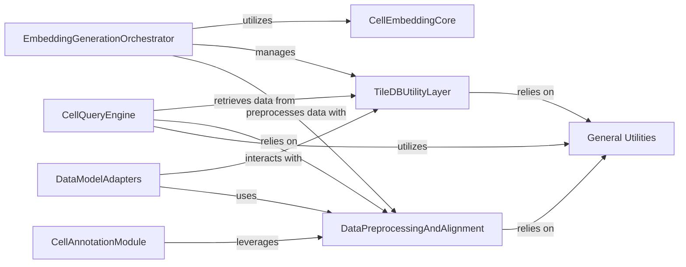

## Component Details

This architecture overview details the `scimilarity` project's subsystem, focusing on how various components interact to generate cell embeddings, query data, and perform annotations. The `General Utilities` component serves as a foundational layer, providing core data manipulation and storage functionalities that are leveraged by other specialized components.

### EmbeddingGenerationOrchestrator
This component is responsible for the high-level coordination of the cell embedding generation process. It handles argument parsing, initializes the embedding model, manages TileDB array creation and writing, and triggers the optimization of the final embedding array.

**Related Classes/Methods**:

- <a href="https://github.com/Genentech/scimilarity/blob/master/scripts/build_embeddings.py#L41-L119" target="_blank" rel="noopener noreferrer">`scimilarity.scripts.build_embeddings:main` (41:119)</a>
- <a href="https://github.com/Genentech/scimilarity/blob/master/scripts/build_embeddings.py#L19-L39" target="_blank" rel="noopener noreferrer">`scimilarity.scripts.build_embeddings:get_expression` (19:39)</a>

### CellEmbeddingCore
This is the central component that encapsulates the machine learning model for generating cell embeddings. It takes preprocessed gene expression data as input and produces the corresponding cell embeddings.

**Related Classes/Methods**:

- <a href="https://github.com/Genentech/scimilarity/blob/master/src/scimilarity/cell_embedding.py#L4-L156" target="_blank" rel="noopener noreferrer">`scimilarity.cell_embedding.CellEmbedding` (4:156)</a>

### TileDBUtilityLayer
This component provides a set of utility functions for interacting with TileDB arrays, including optimization, querying dataframes, and handling embedding retrieval.

**Related Classes/Methods**:

- `scimilarity.utils.optimize_tiledb_array` (full file reference)
- `scimilarity.utils.query_tiledb_df` (full file reference)
- `scimilarity.utils.embedding_from_tiledb` (full file reference)

### DataPreprocessingAndAlignment
This component is responsible for preparing raw biological data for analysis, specifically focusing on aligning datasets based on common features.

**Related Classes/Methods**:

- `scimilarity.utils.align_dataset` (full file reference)
- <a href="https://github.com/Genentech/scimilarity/blob/master/scripts/build_embeddings.py#L19-L39" target="_blank" rel="noopener noreferrer">`scimilarity.scripts.build_embeddings:get_expression` (19:39)</a>

### CellQueryEngine
This component provides the core logic for querying and searching cell data, including retrieving precomputed embeddings and finding nearest neighbors based on centroids or cluster centroids.

**Related Classes/Methods**:

- <a href="https://github.com/Genentech/scimilarity/blob/master/src/scimilarity/cell_query.py#L6-L743" target="_blank" rel="noopener noreferrer">`scimilarity.cell_query.CellQuery` (6:743)</a>
- `scimilarity.utils.get_centroid` (full file reference)
- `scimilarity.utils.get_cluster_centroids` (full file reference)

### CellAnnotationModule
This module is dedicated to annotating cell datasets. It leverages data alignment capabilities to assign biological labels or characteristics to cells based on their expression profiles or embeddings.

**Related Classes/Methods**:

- <a href="https://github.com/Genentech/scimilarity/blob/master/src/scimilarity/cell_annotation.py#L281-L319" target="_blank" rel="noopener noreferrer">`scimilarity.cell_annotation.CellAnnotation:annotate_dataset` (281:319)</a>

### DataModelAdapters
This component provides specialized data modules that adapt different data formats (e.g., TileDB multisets, AnnData) into a usable structure for the scimilarity system, facilitating data loading and preparation for specific tasks like metric learning.

**Related Classes/Methods**:

- <a href="https://github.com/Genentech/scimilarity/blob/master/src/scimilarity/tiledb_data_models.py#L121-L631" target="_blank" rel="noopener noreferrer">`scimilarity.tiledb_data_models.CellMultisetDataModule` (121:631)</a>
- <a href="https://github.com/Genentech/scimilarity/blob/master/src/scimilarity/anndata_data_models.py#L39-L262" target="_blank" rel="noopener noreferrer">`scimilarity.anndata_data_models.MetricLearningDataModule` (39:262)</a>

### General Utilities
This component provides a collection of general-purpose utility functions that support various operations across the scimilarity project, such as optimizing TileDB arrays, querying dataframes, aligning datasets, and calculating centroids.

**Related Classes/Methods**:

- <a href="https://github.com/Genentech/scimilarity/blob/master/src/scimilarity/utils.py#L290-L325" target="_blank" rel="noopener noreferrer">`scimilarity.utils.optimize_tiledb_array` (290:325)</a>
- <a href="https://github.com/Genentech/scimilarity/blob/master/src/scimilarity/utils.py#L328-L347" target="_blank" rel="noopener noreferrer">`scimilarity.utils.query_tiledb_df` (328:347)</a>
- <a href="https://github.com/Genentech/scimilarity/blob/master/src/scimilarity/utils.py#L50-L109" target="_blank" rel="noopener noreferrer">`scimilarity.utils.align_dataset` (50:109)</a>
- <a href="https://github.com/Genentech/scimilarity/blob/master/src/scimilarity/utils.py#L440-L469" target="_blank" rel="noopener noreferrer">`scimilarity.utils.embedding_from_tiledb` (440:469)</a>
- <a href="https://github.com/Genentech/scimilarity/blob/master/src/scimilarity/utils.py#L170-L189" target="_blank" rel="noopener noreferrer">`scimilarity.utils.get_centroid` (170:189)</a>
- <a href="https://github.com/Genentech/scimilarity/blob/master/src/scimilarity/utils.py#L210-L287" target="_blank" rel="noopener noreferrer">`scimilarity.utils.get_cluster_centroids` (210:287)</a>

### [FAQ](https://github.com/CodeBoarding/GeneratedOnBoardings/tree/main?tab=readme-ov-file#faq)