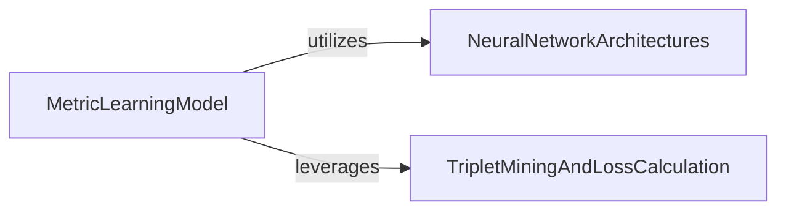

## Component Details

The Metric Learning Core subsystem is designed to learn meaningful cell representations through a combination of neural network architectures and metric learning principles. The main flow involves the `MetricLearningModel` orchestrating the training process, which includes encoding input data into a latent space using `NeuralNetworkArchitectures`, reconstructing the data, and then calculating a combined loss based on both reconstruction error and triplet loss. The `TripletMiningAndLossCalculation` component is crucial for generating effective triplets and computing the metric learning objective, guiding the model to learn discriminative embeddings. The purpose of this subsystem is to produce robust and biologically relevant cell embeddings.

### MetricLearningModel
This component orchestrates the entire metric learning process, including model initialization, forward pass, loss calculation, training, validation, testing, and model persistence. It acts as the central coordinator for the learning pipeline.

**Related Classes/Methods**:

- <a href="https://github.com/Genentech/scimilarity/blob/master/src/scimilarity/training_models.py#L15-L686" target="_blank" rel="noopener noreferrer">`scimilarity.training_models.MetricLearning` (15:686)</a>
- <a href="https://github.com/Genentech/scimilarity/blob/master/src/scimilarity/training_models.py#L73-L169" target="_blank" rel="noopener noreferrer">`scimilarity.src.scimilarity.training_models.MetricLearning:__init__` (73:169)</a>
- <a href="https://github.com/Genentech/scimilarity/blob/master/src/scimilarity/training_models.py#L187-L205" target="_blank" rel="noopener noreferrer">`scimilarity.src.scimilarity.training_models.MetricLearning:forward` (187:205)</a>
- <a href="https://github.com/Genentech/scimilarity/blob/master/src/scimilarity/training_models.py#L207-L289" target="_blank" rel="noopener noreferrer">`scimilarity.src.scimilarity.training_models.MetricLearning:get_losses` (207:289)</a>
- <a href="https://github.com/Genentech/scimilarity/blob/master/src/scimilarity/training_models.py#L315-L392" target="_blank" rel="noopener noreferrer">`scimilarity.src.scimilarity.training_models.MetricLearning:training_step` (315:392)</a>
- <a href="https://github.com/Genentech/scimilarity/blob/master/src/scimilarity/training_models.py#L399-L412" target="_blank" rel="noopener noreferrer">`scimilarity.src.scimilarity.training_models.MetricLearning:validation_step` (399:412)</a>
- <a href="https://github.com/Genentech/scimilarity/blob/master/src/scimilarity/training_models.py#L414-L419" target="_blank" rel="noopener noreferrer">`scimilarity.src.scimilarity.training_models.MetricLearning:on_validation_epoch_end` (414:419)</a>
- <a href="https://github.com/Genentech/scimilarity/blob/master/src/scimilarity/training_models.py#L426-L439" target="_blank" rel="noopener noreferrer">`scimilarity.src.scimilarity.training_models.MetricLearning:test_step` (426:439)</a>
- <a href="https://github.com/Genentech/scimilarity/blob/master/src/scimilarity/training_models.py#L441-L446" target="_blank" rel="noopener noreferrer">`scimilarity.src.scimilarity.training_models.MetricLearning:on_test_epoch_end` (441:446)</a>
- <a href="https://github.com/Genentech/scimilarity/blob/master/src/scimilarity/training_models.py#L448-L497" target="_blank" rel="noopener noreferrer">`scimilarity.src.scimilarity.training_models.MetricLearning:_eval_step` (448:497)</a>
- <a href="https://github.com/Genentech/scimilarity/blob/master/src/scimilarity/training_models.py#L566-L638" target="_blank" rel="noopener noreferrer">`scimilarity.src.scimilarity.training_models.MetricLearning:save_all` (566:638)</a>
- <a href="https://github.com/Genentech/scimilarity/blob/master/src/scimilarity/training_models.py#L640-L686" target="_blank" rel="noopener noreferrer">`scimilarity.src.scimilarity.training_models.MetricLearning:load_state` (640:686)</a>

### NeuralNetworkArchitectures
This component provides the fundamental neural network building blocks, specifically the Encoder for generating latent embeddings and the Decoder for reconstructing input data. These models are responsible for the core data transformation.

**Related Classes/Methods**:

- <a href="https://github.com/Genentech/scimilarity/blob/master/src/scimilarity/nn_models.py#L12-L110" target="_blank" rel="noopener noreferrer">`scimilarity.nn_models.Encoder` (12:110)</a>
- <a href="https://github.com/Genentech/scimilarity/blob/master/src/scimilarity/nn_models.py#L113-L206" target="_blank" rel="noopener noreferrer">`scimilarity.nn_models.Decoder` (113:206)</a>
- <a href="https://github.com/Genentech/scimilarity/blob/master/src/scimilarity/nn_models.py#L82-L91" target="_blank" rel="noopener noreferrer">`scimilarity.src.scimilarity.nn_models.Encoder.save_state` (82:91)</a>
- <a href="https://github.com/Genentech/scimilarity/blob/master/src/scimilarity/nn_models.py#L178-L187" target="_blank" rel="noopener noreferrer">`scimilarity.src.scimilarity.nn_models.Decoder.save_state` (178:187)</a>
- <a href="https://github.com/Genentech/scimilarity/blob/master/src/scimilarity/nn_models.py#L93-L110" target="_blank" rel="noopener noreferrer">`scimilarity.src.scimilarity.nn_models.Encoder.load_state` (93:110)</a>
- <a href="https://github.com/Genentech/scimilarity/blob/master/src/scimilarity/nn_models.py#L189-L206" target="_blank" rel="noopener noreferrer">`scimilarity.src.scimilarity.nn_models.Decoder.load_state` (189:206)</a>

### TripletMiningAndLossCalculation
This component focuses on the generation of effective triplets for metric learning and the subsequent calculation of the triplet loss. It includes strategies for selecting negative samples and evaluating embedding quality using metrics like Average Silhouette Width. The `TripletLoss` class wraps the `TripletSelector` to provide the overall triplet loss functionality.

**Related Classes/Methods**:

- <a href="https://github.com/Genentech/scimilarity/blob/master/src/scimilarity/triplet_selector.py#L17-L354" target="_blank" rel="noopener noreferrer">`scimilarity.triplet_selector.TripletSelector` (17:354)</a>
- <a href="https://github.com/Genentech/scimilarity/blob/master/src/scimilarity/triplet_selector.py#L36-L51" target="_blank" rel="noopener noreferrer">`scimilarity.src.scimilarity.triplet_selector.TripletSelector:__init__` (36:51)</a>
- <a href="https://github.com/Genentech/scimilarity/blob/master/src/scimilarity/triplet_selector.py#L53-L199" target="_blank" rel="noopener noreferrer">`scimilarity.src.scimilarity.triplet_selector.TripletSelector:get_triplets_idx` (53:199)</a>
- <a href="https://github.com/Genentech/scimilarity/blob/master/src/scimilarity/triplet_selector.py#L280-L354" target="_blank" rel="noopener noreferrer">`scimilarity.src.scimilarity.triplet_selector.TripletSelector:get_asw` (280:354)</a>
- <a href="https://github.com/Genentech/scimilarity/blob/master/src/scimilarity/triplet_selector.py#L201-L221" target="_blank" rel="noopener noreferrer">`scimilarity.src.scimilarity.triplet_selector.TripletSelector.pdist` (201:221)</a>
- <a href="https://github.com/Genentech/scimilarity/blob/master/src/scimilarity/triplet_selector.py#L257-L278" target="_blank" rel="noopener noreferrer">`scimilarity.src.scimilarity.triplet_selector.TripletSelector.semihard_negative` (257:278)</a>
- <a href="https://github.com/Genentech/scimilarity/blob/master/src/scimilarity/triplet_selector.py#L223-L238" target="_blank" rel="noopener noreferrer">`scimilarity.src.scimilarity.triplet_selector.TripletSelector.hardest_negative` (223:238)</a>
- <a href="https://github.com/Genentech/scimilarity/blob/master/src/scimilarity/triplet_selector.py#L240-L255" target="_blank" rel="noopener noreferrer">`scimilarity.src.scimilarity.triplet_selector.TripletSelector.random_negative` (240:255)</a>
- <a href="https://github.com/Genentech/scimilarity/blob/master/src/scimilarity/triplet_selector.py#L357-L436" target="_blank" rel="noopener noreferrer">`scimilarity.triplet_selector.TripletLoss` (357:436)</a>
- <a href="https://github.com/Genentech/scimilarity/blob/master/src/scimilarity/triplet_selector.py#L381-L397" target="_blank" rel="noopener noreferrer">`scimilarity.src.scimilarity.triplet_selector.TripletLoss:__init__` (381:397)</a>
- <a href="https://github.com/Genentech/scimilarity/blob/master/src/scimilarity/triplet_selector.py#L399-L436" target="_blank" rel="noopener noreferrer">`scimilarity.src.scimilarity.triplet_selector.TripletLoss:forward` (399:436)</a>

### [FAQ](https://github.com/CodeBoarding/GeneratedOnBoardings/tree/main?tab=readme-ov-file#faq)