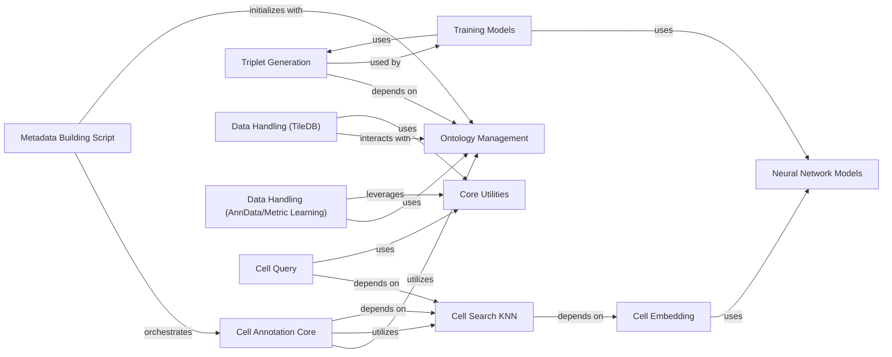

## Component Details

The scimilarity project provides a comprehensive framework for single-cell data analysis, focusing on cell annotation, embedding, and similarity calculations. The system's core functionality is built around the Ontology Management component, which handles the loading, mapping, and querying of cell ontology data, providing hierarchical relationships and similarity metrics. This ontological information is crucial for various downstream tasks, including Cell Annotation Core for assigning cell types, Triplet Generation for creating biologically meaningful training data for metric learning, and Data Handling components (both TileDB and AnnData/Metric Learning) for preparing and managing datasets. Cell Embedding generates numerical representations of cells using Neural Network Models, which are then utilized by Cell Search KNN and Cell Query for efficient retrieval of similar cells. The Training Models component orchestrates the metric learning process, integrating neural networks and triplet selection. Finally, the Metadata Building Script acts as an orchestrator, coordinating these components to build cell search metadata, while Core Utilities provide general helper functions across the system.

### Ontology Management
This component is responsible for all operations related to biological ontologies. It handles loading ontology graphs, mapping IDs to names, and performing various graph traversals such as finding children, parents, siblings, ancestors, and descendants. It also includes functions for calculating ontology similarity and silhouette width based on ontological relationships.

**Related Classes/Methods**:

- <a href="https://github.com/Genentech/scimilarity/blob/master/src/scimilarity/ontologies.py#L7-L27" target="_blank" rel="noopener noreferrer">`scimilarity.src.scimilarity.ontologies.subset_nodes_to_set` (7:27)</a>
- <a href="https://github.com/Genentech/scimilarity/blob/master/src/scimilarity/ontologies.py#L30-L51" target="_blank" rel="noopener noreferrer">`scimilarity.ontologies.import_cell_ontology` (30:51)</a>
- <a href="https://github.com/Genentech/scimilarity/blob/master/src/scimilarity/ontologies.py#L126-L144" target="_blank" rel="noopener noreferrer">`scimilarity.ontologies.get_id_mapper` (126:144)</a>
- <a href="https://github.com/Genentech/scimilarity/blob/master/src/scimilarity/ontologies.py#L147-L172" target="_blank" rel="noopener noreferrer">`scimilarity.src.scimilarity.ontologies:get_children` (147:172)</a>
- <a href="https://github.com/Genentech/scimilarity/blob/master/src/scimilarity/ontologies.py#L175-L200" target="_blank" rel="noopener noreferrer">`scimilarity.src.scimilarity.ontologies:get_parents` (175:200)</a>
- <a href="https://github.com/Genentech/scimilarity/blob/master/src/scimilarity/ontologies.py#L203-L231" target="_blank" rel="noopener noreferrer">`scimilarity.src.scimilarity.ontologies:get_siblings` (203:231)</a>
- <a href="https://github.com/Genentech/scimilarity/blob/master/src/scimilarity/ontologies.py#L234-L264" target="_blank" rel="noopener noreferrer">`scimilarity.src.scimilarity.ontologies:get_all_ancestors` (234:264)</a>
- <a href="https://github.com/Genentech/scimilarity/blob/master/src/scimilarity/ontologies.py#L267-L301" target="_blank" rel="noopener noreferrer">`scimilarity.src.scimilarity.ontologies:get_all_descendants` (267:301)</a>
- <a href="https://github.com/Genentech/scimilarity/blob/master/src/scimilarity/ontologies.py#L331-L369" target="_blank" rel="noopener noreferrer">`scimilarity.src.scimilarity.ontologies:find_most_viable_parent` (331:369)</a>
- <a href="https://github.com/Genentech/scimilarity/blob/master/src/scimilarity/ontologies.py#L372-L401" target="_blank" rel="noopener noreferrer">`scimilarity.src.scimilarity.ontologies:ontology_similarity` (372:401)</a>
- <a href="https://github.com/Genentech/scimilarity/blob/master/src/scimilarity/ontologies.py#L404-L436" target="_blank" rel="noopener noreferrer">`scimilarity.src.scimilarity.ontologies:all_pair_similarities` (404:436)</a>
- <a href="https://github.com/Genentech/scimilarity/blob/master/src/scimilarity/ontologies.py#L439-L517" target="_blank" rel="noopener noreferrer">`scimilarity.src.scimilarity.ontologies:ontology_silhouette_width` (439:517)</a>

### Cell Annotation Core
This component provides the core functionalities for annotating cells. It involves using pre-trained models or algorithms to assign cell types to single-cell data, leveraging ontological information and cell search capabilities.

**Related Classes/Methods**:

- <a href="https://github.com/Genentech/scimilarity/blob/master/src/scimilarity/cell_annotation.py#L6-L319" target="_blank" rel="noopener noreferrer">`scimilarity.cell_annotation.CellAnnotation` (6:319)</a>
- <a href="https://github.com/Genentech/scimilarity/blob/master/src/scimilarity/cell_annotation.py#L118-L146" target="_blank" rel="noopener noreferrer">`scimilarity.cell_annotation.CellAnnotation.safelist_celltypes` (118:146)</a>
- <a href="https://github.com/Genentech/scimilarity/blob/master/src/scimilarity/cell_annotation.py#L148-L279" target="_blank" rel="noopener noreferrer">`scimilarity.cell_annotation.CellAnnotation.get_predictions_knn` (148:279)</a>

### Triplet Generation
This component is dedicated to generating triplets of data points, which are essential for metric learning algorithms. It interacts with the Ontology Management component to incorporate ontological constraints or relationships when selecting these triplets, ensuring biologically meaningful training data.

**Related Classes/Methods**:

- <a href="https://github.com/Genentech/scimilarity/blob/master/src/scimilarity/triplet_selector.py#L17-L354" target="_blank" rel="noopener noreferrer">`scimilarity.src.scimilarity.triplet_selector.TripletSelector` (17:354)</a>
- <a href="https://github.com/Genentech/scimilarity/blob/master/src/scimilarity/triplet_selector.py#L36-L51" target="_blank" rel="noopener noreferrer">`scimilarity.src.scimilarity.triplet_selector.TripletSelector:__init__` (36:51)</a>
- <a href="https://github.com/Genentech/scimilarity/blob/master/src/scimilarity/triplet_selector.py#L53-L199" target="_blank" rel="noopener noreferrer">`scimilarity.src.scimilarity.triplet_selector.TripletSelector:get_triplets_idx` (53:199)</a>
- <a href="https://github.com/Genentech/scimilarity/blob/master/src/scimilarity/triplet_selector.py#L280-L354" target="_blank" rel="noopener noreferrer">`scimilarity.src.scimilarity.triplet_selector.TripletSelector:get_asw` (280:354)</a>
- <a href="https://github.com/Genentech/scimilarity/blob/master/src/scimilarity/triplet_selector.py#L201-L221" target="_blank" rel="noopener noreferrer">`scimilarity.src.scimilarity.triplet_selector.TripletSelector.pdist` (201:221)</a>
- <a href="https://github.com/Genentech/scimilarity/blob/master/src/scimilarity/triplet_selector.py#L257-L278" target="_blank" rel="noopener noreferrer">`scimilarity.src.scimilarity.triplet_selector.TripletSelector.semihard_negative` (257:278)</a>
- <a href="https://github.com/Genentech/scimilarity/blob/master/src/scimilarity/triplet_selector.py#L223-L238" target="_blank" rel="noopener noreferrer">`scimilarity.src.scimilarity.triplet_selector.TripletSelector.hardest_negative` (223:238)</a>
- <a href="https://github.com/Genentech/scimilarity/blob/master/src/scimilarity/triplet_selector.py#L240-L255" target="_blank" rel="noopener noreferrer">`scimilarity.src.scimilarity.triplet_selector.TripletSelector.random_negative` (240:255)</a>

### Data Handling (TileDB)
This component manages data operations specifically for datasets stored or accessed via TileDB. It includes functionalities for mapping cell type IDs to names and processing labels, often requiring interaction with ontology information and general utilities.

**Related Classes/Methods**:

- <a href="https://github.com/Genentech/scimilarity/blob/master/src/scimilarity/tiledb_data_models.py#L121-L631" target="_blank" rel="noopener noreferrer">`scimilarity.src.scimilarity.tiledb_data_models.CellMultisetDataModule` (121:631)</a>
- <a href="https://github.com/Genentech/scimilarity/blob/master/src/scimilarity/tiledb_data_models.py#L384-L397" target="_blank" rel="noopener noreferrer">`scimilarity.src.scimilarity.tiledb_data_models.CellMultisetDataModule:map_cell_type_id2name` (384:397)</a>
- <a href="https://github.com/Genentech/scimilarity/blob/master/src/scimilarity/tiledb_data_models.py#L399-L447" target="_blank" rel="noopener noreferrer">`scimilarity.src.scimilarity.tiledb_data_models.CellMultisetDataModule:remove_singleton_label_ids` (399:447)</a>

### Data Handling (AnnData/Metric Learning)
This component is responsible for preparing and managing data, particularly AnnData objects, for metric learning tasks. It handles operations like subsetting valid terms and aligning datasets, often relying on ontology information and general utility functions.

**Related Classes/Methods**:

- <a href="https://github.com/Genentech/scimilarity/blob/master/src/scimilarity/anndata_data_models.py#L39-L262" target="_blank" rel="noopener noreferrer">`scimilarity.src.scimilarity.anndata_data_models.MetricLearningDataModule` (39:262)</a>
- <a href="https://github.com/Genentech/scimilarity/blob/master/src/scimilarity/anndata_data_models.py#L68-L131" target="_blank" rel="noopener noreferrer">`scimilarity.src.scimilarity.anndata_data_models.MetricLearningDataModule:__init__` (68:131)</a>
- <a href="https://github.com/Genentech/scimilarity/blob/master/src/scimilarity/anndata_data_models.py#L133-L151" target="_blank" rel="noopener noreferrer">`scimilarity.src.scimilarity.anndata_data_models.MetricLearningDataModule.subset_valid_terms` (133:151)</a>
- <a href="https://github.com/Genentech/scimilarity/blob/master/src/scimilarity/anndata_data_models.py#L13-L36" target="_blank" rel="noopener noreferrer">`scimilarity.src.scimilarity.anndata_data_models.scDataset` (13:36)</a>

### Core Utilities
This component provides a collection of general utility functions that are used across different parts of the scimilarity project. These functions offer common helper operations that support various data processing and analysis tasks.

**Related Classes/Methods**:

- `scimilarity.src.scimilarity.utils.align_dataset` (full file reference)

### Metadata Building Script
This component represents the main script responsible for orchestrating the process of building cell search metadata. It acts as an entry point, coordinating calls to other components like Cell Annotation Core and Ontology Management to achieve its goal.

**Related Classes/Methods**:

- <a href="https://github.com/Genentech/scimilarity/blob/master/scripts/build_cellsearch_metadata.py#L15-L118" target="_blank" rel="noopener noreferrer">`scimilarity.scripts.build_cellsearch_metadata:main` (15:118)</a>

### Cell Embedding
This component is responsible for generating numerical representations (embeddings) of cells, which are crucial for downstream tasks like similarity calculations and cell search. It utilizes neural network models for this purpose.

**Related Classes/Methods**:

- <a href="https://github.com/Genentech/scimilarity/blob/master/src/scimilarity/cell_embedding.py#L4-L156" target="_blank" rel="noopener noreferrer">`scimilarity.cell_embedding.CellEmbedding` (4:156)</a>

### Neural Network Models
This component defines and provides various neural network architectures used across the project, particularly for cell embedding and metric learning.

**Related Classes/Methods**:

- <a href="https://github.com/Genentech/scimilarity/blob/master/src/scimilarity/nn_models.py#L113-L206" target="_blank" rel="noopener noreferrer">`scimilarity.nn_models.Decoder` (113:206)</a>
- <a href="https://github.com/Genentech/scimilarity/blob/master/src/scimilarity/nn_models.py#L12-L110" target="_blank" rel="noopener noreferrer">`scimilarity.nn_models.Encoder` (12:110)</a>

### Training Models
This component encapsulates the logic for training machine learning models, specifically metric learning models. It integrates neural network models and triplet selection mechanisms to optimize model performance.

**Related Classes/Methods**:

- <a href="https://github.com/Genentech/scimilarity/blob/master/src/scimilarity/training_models.py#L15-L686" target="_blank" rel="noopener noreferrer">`scimilarity.training_models.MetricLearning` (15:686)</a>
- <a href="https://github.com/Genentech/scimilarity/blob/master/src/scimilarity/triplet_selector.py#L357-L436" target="_blank" rel="noopener noreferrer">`scimilarity.triplet_selector.TripletLoss` (357:436)</a>

### Cell Search KNN
This component provides functionalities for performing k-nearest neighbor searches on cell embeddings, enabling efficient retrieval of similar cells. It relies on the Cell Embedding component.

**Related Classes/Methods**:

- <a href="https://github.com/Genentech/scimilarity/blob/master/src/scimilarity/cell_search_knn.py#L6-L103" target="_blank" rel="noopener noreferrer">`scimilarity.cell_search_knn.CellSearchKNN` (6:103)</a>

### Cell Query
This component handles querying cell data, likely leveraging the Cell Search KNN and Core Utilities components to retrieve and process information based on specific criteria.

**Related Classes/Methods**:

- <a href="https://github.com/Genentech/scimilarity/blob/master/src/scimilarity/cell_query.py#L6-L743" target="_blank" rel="noopener noreferrer">`scimilarity.cell_query.CellQuery` (6:743)</a>

### [FAQ](https://github.com/CodeBoarding/GeneratedOnBoardings/tree/main?tab=readme-ov-file#faq)