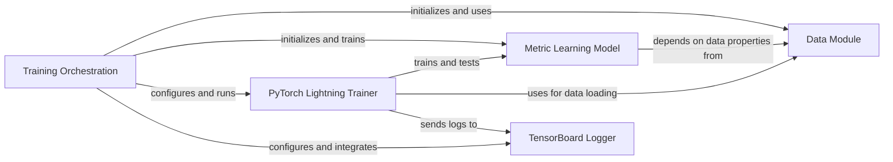

## Component Details

This graph illustrates the core components and their interactions within the Training Orchestration subsystem of the SCimilarity project. The `Training Orchestration` component acts as the central control, managing the entire training lifecycle. It initializes and coordinates with the `Data Module` for data preparation and the `Metric Learning Model` for the actual model training. It leverages the `PyTorch Lightning Trainer` to automate the training process and integrates with the `TensorBoard Logger` for monitoring and visualization of training progress and results.

### Training Orchestration
This component manages the high-level execution flow for training the metric learning model, including initiating the training process, coordinating with data modules, and handling model saving and result logging.

**Related Classes/Methods**:

- <a href="https://github.com/Genentech/scimilarity/blob/master/scripts/train.py#L64-L229" target="_blank" rel="noopener noreferrer">`scimilarity.scripts.train:train` (64:229)</a>
- <a href="https://github.com/Genentech/scimilarity/blob/master/scripts/train.py#L232-L261" target="_blank" rel="noopener noreferrer">`scimilarity.scripts.train:main` (232:261)</a>

### Data Module
This component handles the loading, preprocessing, and batching of single-cell RNA sequencing data from TileDB arrays. It manages data splitting into training and validation sets, applies filtering and harmonization of cell types, calculates sampling weights, and provides data loaders for the PyTorch Lightning trainer.

**Related Classes/Methods**:

- <a href="https://github.com/Genentech/scimilarity/blob/master/src/scimilarity/tiledb_data_models.py#L121-L631" target="_blank" rel="noopener noreferrer">`scimilarity.tiledb_data_models.CellMultisetDataModule` (121:631)</a>

### Metric Learning Model
This component defines the neural network architecture for metric learning, including an encoder and a decoder. It implements the forward pass, calculates triplet loss and reconstruction loss, and handles optimization and logging during training. It also provides functionality to save and load the trained model and its hyperparameters.

**Related Classes/Methods**:

- <a href="https://github.com/Genentech/scimilarity/blob/master/src/scimilarity/training_models.py#L15-L686" target="_blank" rel="noopener noreferrer">`scimilarity.training_models.MetricLearning` (15:686)</a>
- <a href="https://github.com/Genentech/scimilarity/blob/master/src/scimilarity/training_models.py#L566-L638" target="_blank" rel="noopener noreferrer">`scimilarity.training_models.MetricLearning.save_all` (566:638)</a>

### PyTorch Lightning Trainer
This component is a high-level abstraction provided by PyTorch Lightning to automate the training loop, validation, and testing. It handles device placement, logging, and checkpointing.

**Related Classes/Methods**: _None_

### TensorBoard Logger
This component is responsible for logging training metrics, hyperparameters, and other relevant information to TensorBoard for visualization and analysis.

**Related Classes/Methods**: _None_

### [FAQ](https://github.com/CodeBoarding/GeneratedOnBoardings/tree/main?tab=readme-ov-file#faq)