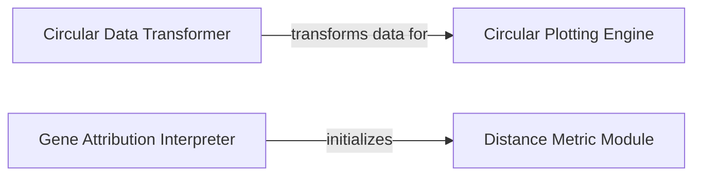

## Component Details

The Visualization & Interpretation subsystem provides functionalities for visualizing single-cell data, with a focus on hierarchical and count-based visualizations, and offers tools for interpreting relationships within learned embedding spaces, including simple distance calculations. The main flow involves transforming raw data into a suitable format for circular plots, rendering these plots, and interpreting model outputs through gene attribution and distance calculations.

### Circular Data Transformer
This component is responsible for transforming raw data into a hierarchical dictionary format suitable for circular visualizations, including aggregation of counts and assignment of sizes. It also handles the recursive retrieval of children data for nested circles.

**Related Classes/Methods**:

- <a href="https://github.com/Genentech/scimilarity/blob/master/src/scimilarity/visualizations.py#L4-L53" target="_blank" rel="noopener noreferrer">`scimilarity.src.scimilarity.visualizations.aggregate_counts` (4:53)</a>
- <a href="https://github.com/Genentech/scimilarity/blob/master/src/scimilarity/visualizations.py#L56-L105" target="_blank" rel="noopener noreferrer">`scimilarity.src.scimilarity.visualizations.assign_size` (56:105)</a>
- <a href="https://github.com/Genentech/scimilarity/blob/master/src/scimilarity/visualizations.py#L196-L221" target="_blank" rel="noopener noreferrer">`scimilarity.src.scimilarity.visualizations:get_children_data` (196:221)</a>
- <a href="https://github.com/Genentech/scimilarity/blob/master/src/scimilarity/visualizations.py#L224-L249" target="_blank" rel="noopener noreferrer">`scimilarity.src.scimilarity.visualizations:circ_dict2data` (224:249)</a>

### Circular Plotting Engine
This component handles the rendering of circular plots, taking the transformed data and generating a visual representation using the circlify library. It also provides a high-level function to orchestrate the data transformation and drawing process for 'hits' circles.

**Related Classes/Methods**:

- <a href="https://github.com/Genentech/scimilarity/blob/master/src/scimilarity/visualizations.py#L252-L398" target="_blank" rel="noopener noreferrer">`scimilarity.src.scimilarity.visualizations.draw_circles` (252:398)</a>
- <a href="https://github.com/Genentech/scimilarity/blob/master/src/scimilarity/visualizations.py#L401-L432" target="_blank" rel="noopener noreferrer">`scimilarity.src.scimilarity.visualizations:hits_circles` (401:432)</a>

### Distance Metric Module
This module defines a neural network module, SimpleDist, for calculating the sum of squares distance between encoded representations. It serves as a fundamental building block for model interpretation by providing a quantifiable measure of dissimilarity.

**Related Classes/Methods**:

- <a href="https://github.com/Genentech/scimilarity/blob/master/src/scimilarity/interpreter.py#L5-L40" target="_blank" rel="noopener noreferrer">`scimilarity.src.scimilarity.interpreter.SimpleDist` (5:40)</a>

### Gene Attribution Interpreter
This component provides functionalities for interpreting machine learning models by calculating and analyzing gene attributions. It leverages integrated gradients to identify significant genes that contribute to the distance between cell representations, and offers methods for ranking and plotting these attributions.

**Related Classes/Methods**:

- <a href="https://github.com/Genentech/scimilarity/blob/master/src/scimilarity/interpreter.py#L43-L213" target="_blank" rel="noopener noreferrer">`scimilarity.interpreter.Interpreter` (43:213)</a>
- <a href="https://github.com/Genentech/scimilarity/blob/master/src/scimilarity/interpreter.py#L58-L67" target="_blank" rel="noopener noreferrer">`scimilarity.src.scimilarity.interpreter.Interpreter:__init__` (58:67)</a>

### [FAQ](https://github.com/CodeBoarding/GeneratedOnBoardings/tree/main?tab=readme-ov-file#faq)