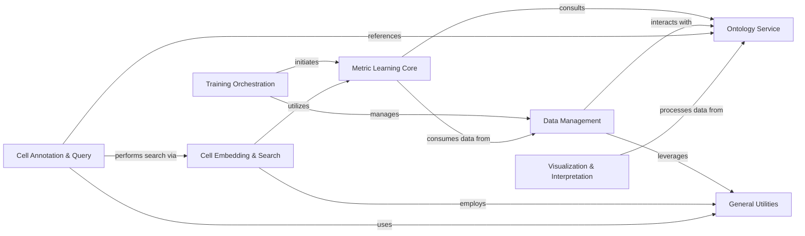

## Component Details

The `scimilarity` project is designed for single-cell data analysis, primarily focusing on metric learning to generate meaningful cell embeddings. The main flow involves training a metric learning model using various data sources, generating cell embeddings, and then utilizing these embeddings for tasks such as cell annotation and querying. It leverages ontology information for data preparation and analysis, and provides utilities for data management and visualization.

### Training Orchestration
This component manages the high-level execution flow for training the metric learning model, including initiating the training process, coordinating with data modules, and handling model saving and result logging.

**Related Classes/Methods**:

- <a href="https://github.com/Genentech/scimilarity/blob/master/scripts/train.py#L64-L229" target="_blank" rel="noopener noreferrer">`scimilarity.scripts.train:train` (64:229)</a>
- <a href="https://github.com/Genentech/scimilarity/blob/master/scripts/train.py#L232-L261" target="_blank" rel="noopener noreferrer">`scimilarity.scripts.train:main` (232:261)</a>

### Metric Learning Core
This component encapsulates the core metric learning model, including its neural network architectures (Encoder and Decoder) for embedding and reconstruction, and the triplet selection and loss mechanisms crucial for learning meaningful cell representations.

**Related Classes/Methods**:

- <a href="https://github.com/Genentech/scimilarity/blob/master/src/scimilarity/training_models.py#L15-L686" target="_blank" rel="noopener noreferrer">`scimilarity.training_models.MetricLearning` (15:686)</a>
- <a href="https://github.com/Genentech/scimilarity/blob/master/src/scimilarity/training_models.py#L73-L169" target="_blank" rel="noopener noreferrer">`scimilarity.src.scimilarity.training_models.MetricLearning:__init__` (73:169)</a>
- <a href="https://github.com/Genentech/scimilarity/blob/master/src/scimilarity/training_models.py#L187-L205" target="_blank" rel="noopener noreferrer">`scimilarity.src.scimilarity.training_models.MetricLearning:forward` (187:205)</a>
- <a href="https://github.com/Genentech/scimilarity/blob/master/src/scimilarity/training_models.py#L207-L289" target="_blank" rel="noopener noreferrer">`scimilarity.src.scimilarity.training_models.MetricLearning:get_losses` (207:289)</a>
- <a href="https://github.com/Genentech/scimilarity/blob/master/src/scimilarity/training_models.py#L315-L392" target="_blank" rel="noopener noreferrer">`scimilarity.src.scimilarity.training_models.MetricLearning:training_step` (315:392)</a>
- <a href="https://github.com/Genentech/scimilarity/blob/master/src/scimilarity/training_models.py#L399-L412" target="_blank" rel="noopener noreferrer">`scimilarity.src.scimilarity.training_models.MetricLearning:validation_step` (399:412)</a>
- <a href="https://github.com/Genentech/scimilarity/blob/master/src/scimilarity/training_models.py#L414-L419" target="_blank" rel="noopener noreferrer">`scimilarity.src.scimilarity.training_models.MetricLearning:on_validation_epoch_end` (414:419)</a>
- <a href="https://github.com/Genentech/scimilarity/blob/master/src/scimilarity/training_models.py#L426-L439" target="_blank" rel="noopener noreferrer">`scimilarity.src.scimilarity.training_models.MetricLearning:test_step` (426:439)</a>
- <a href="https://github.com/Genentech/scimilarity/blob/master/src/scimilarity/training_models.py#L441-L446" target="_blank" rel="noopener noreferrer">`scimilarity.src.scimilarity.training_models.MetricLearning:on_test_epoch_end` (441:446)</a>
- <a href="https://github.com/Genentech/scimilarity/blob/master/src/scimilarity/training_models.py#L448-L497" target="_blank" rel="noopener noreferrer">`scimilarity.src.scimilarity.training_models.MetricLearning:_eval_step` (448:497)</a>
- <a href="https://github.com/Genentech/scimilarity/blob/master/src/scimilarity/training_models.py#L566-L638" target="_blank" rel="noopener noreferrer">`scimilarity.src.scimilarity.training_models.MetricLearning:save_all` (566:638)</a>
- <a href="https://github.com/Genentech/scimilarity/blob/master/src/scimilarity/training_models.py#L640-L686" target="_blank" rel="noopener noreferrer">`scimilarity.src.scimilarity.training_models.MetricLearning:load_state` (640:686)</a>
- <a href="https://github.com/Genentech/scimilarity/blob/master/src/scimilarity/nn_models.py#L12-L110" target="_blank" rel="noopener noreferrer">`scimilarity.nn_models.Encoder` (12:110)</a>
- <a href="https://github.com/Genentech/scimilarity/blob/master/src/scimilarity/nn_models.py#L113-L206" target="_blank" rel="noopener noreferrer">`scimilarity.nn_models.Decoder` (113:206)</a>
- <a href="https://github.com/Genentech/scimilarity/blob/master/src/scimilarity/nn_models.py#L82-L91" target="_blank" rel="noopener noreferrer">`scimilarity.src.scimilarity.nn_models.Encoder.save_state` (82:91)</a>
- <a href="https://github.com/Genentech/scimilarity/blob/master/src/scimilarity/nn_models.py#L178-L187" target="_blank" rel="noopener noreferrer">`scimilarity.src.scimilarity.nn_models.Decoder.save_state` (178:187)</a>
- <a href="https://github.com/Genentech/scimilarity/blob/master/src/scimilarity/nn_models.py#L93-L110" target="_blank" rel="noopener noreferrer">`scimilarity.src.scimilarity.nn_models.Encoder.load_state` (93:110)</a>
- <a href="https://github.com/Genentech/scimilarity/blob/master/src/scimilarity/nn_models.py#L189-L206" target="_blank" rel="noopener noreferrer">`scimilarity.src.scimilarity.nn_models.Decoder.load_state` (189:206)</a>
- <a href="https://github.com/Genentech/scimilarity/blob/master/src/scimilarity/triplet_selector.py#L17-L354" target="_blank" rel="noopener noreferrer">`scimilarity.triplet_selector.TripletSelector` (17:354)</a>
- <a href="https://github.com/Genentech/scimilarity/blob/master/src/scimilarity/triplet_selector.py#L36-L51" target="_blank" rel="noopener noreferrer">`scimilarity.src.scimilarity.triplet_selector.TripletSelector:__init__` (36:51)</a>
- <a href="https://github.com/Genentech/scimilarity/blob/master/src/scimilarity/triplet_selector.py#L53-L199" target="_blank" rel="noopener noreferrer">`scimilarity.src.scimilarity.triplet_selector.TripletSelector:get_triplets_idx` (53:199)</a>
- <a href="https://github.com/Genentech/scimilarity/blob/master/src/scimilarity/triplet_selector.py#L280-L354" target="_blank" rel="noopener noreferrer">`scimilarity.src.scimilarity.triplet_selector.TripletSelector:get_asw` (280:354)</a>
- <a href="https://github.com/Genentech/scimilarity/blob/master/src/scimilarity/triplet_selector.py#L201-L221" target="_blank" rel="noopener noreferrer">`scimilarity.src.scimilarity.triplet_selector.TripletSelector.pdist` (201:221)</a>
- <a href="https://github.com/Genentech/scimilarity/blob/master/src/scimilarity/triplet_selector.py#L257-L278" target="_blank" rel="noopener noreferrer">`scimilarity.src.scimilarity.triplet_selector.TripletSelector.semihard_negative` (257:278)</a>
- <a href="https://github.com/Genentech/scimilarity/blob/master/src/scimilarity/triplet_selector.py#L223-L238" target="_blank" rel="noopener noreferrer">`scimilarity.src.scimilarity.triplet_selector.TripletSelector.hardest_negative` (223:238)</a>
- <a href="https://github.com/Genentech/scimilarity/blob/master/src/scimilarity/triplet_selector.py#L240-L255" target="_blank" rel="noopener noreferrer">`scimilarity.src.scimilarity.triplet_selector.TripletSelector.random_negative` (240:255)</a>
- <a href="https://github.com/Genentech/scimilarity/blob/master/src/scimilarity/triplet_selector.py#L357-L436" target="_blank" rel="noopener noreferrer">`scimilarity.triplet_selector.TripletLoss` (357:436)</a>
- <a href="https://github.com/Genentech/scimilarity/blob/master/src/scimilarity/triplet_selector.py#L381-L397" target="_blank" rel="noopener noreferrer">`scimilarity.src.scimilarity.triplet_selector.TripletLoss:__init__` (381:397)</a>
- <a href="https://github.com/Genentech/scimilarity/blob/master/src/scimilarity/triplet_selector.py#L399-L436" target="_blank" rel="noopener noreferrer">`scimilarity.src.scimilarity.triplet_selector.TripletLoss:forward` (399:436)</a>

### Data Management
This component is responsible for loading, preprocessing, and providing single-cell data from various storage formats (TileDB, Zarr, AnnData). It handles data harmonization, filtering, and prepares data for consumption by the Metric Learning Core.

**Related Classes/Methods**:

- <a href="https://github.com/Genentech/scimilarity/blob/master/src/scimilarity/tiledb_data_models.py#L121-L631" target="_blank" rel="noopener noreferrer">`scimilarity.tiledb_data_models.CellMultisetDataModule` (121:631)</a>
- <a href="https://github.com/Genentech/scimilarity/blob/master/src/scimilarity/tiledb_data_models.py#L186-L363" target="_blank" rel="noopener noreferrer">`scimilarity.src.scimilarity.tiledb_data_models.CellMultisetDataModule:__init__` (186:363)</a>
- <a href="https://github.com/Genentech/scimilarity/blob/master/src/scimilarity/tiledb_data_models.py#L368-L382" target="_blank" rel="noopener noreferrer">`scimilarity.src.scimilarity.tiledb_data_models.CellMultisetDataModule:get_data` (368:382)</a>
- <a href="https://github.com/Genentech/scimilarity/blob/master/src/scimilarity/tiledb_data_models.py#L496-L525" target="_blank" rel="noopener noreferrer">`scimilarity.src.scimilarity.tiledb_data_models.CellMultisetDataModule:harmonize_cell_types` (496:525)</a>
- <a href="https://github.com/Genentech/scimilarity/blob/master/src/scimilarity/tiledb_data_models.py#L399-L447" target="_blank" rel="noopener noreferrer">`scimilarity.src.scimilarity.tiledb_data_models.CellMultisetDataModule:remove_singleton_label_ids` (399:447)</a>
- <a href="https://github.com/Genentech/scimilarity/blob/master/src/scimilarity/tiledb_data_models.py#L384-L397" target="_blank" rel="noopener noreferrer">`scimilarity.src.scimilarity.tiledb_data_models.CellMultisetDataModule:map_cell_type_id2name` (384:397)</a>
- <a href="https://github.com/Genentech/scimilarity/blob/master/src/scimilarity/tiledb_data_models.py#L572-L594" target="_blank" rel="noopener noreferrer">`scimilarity.src.scimilarity.tiledb_data_models.CellMultisetDataModule:train_dataloader` (572:594)</a>
- <a href="https://github.com/Genentech/scimilarity/blob/master/src/scimilarity/tiledb_data_models.py#L596-L620" target="_blank" rel="noopener noreferrer">`scimilarity.src.scimilarity.tiledb_data_models.CellMultisetDataModule:val_dataloader` (596:620)</a>
- <a href="https://github.com/Genentech/scimilarity/blob/master/src/scimilarity/tiledb_data_models.py#L622-L631" target="_blank" rel="noopener noreferrer">`scimilarity.src.scimilarity.tiledb_data_models.CellMultisetDataModule:test_dataloader` (622:631)</a>
- <a href="https://github.com/Genentech/scimilarity/blob/master/src/scimilarity/tiledb_data_models.py#L61-L118" target="_blank" rel="noopener noreferrer">`scimilarity.src.scimilarity.tiledb_data_models.CellSampler` (61:118)</a>
- <a href="https://github.com/Genentech/scimilarity/blob/master/src/scimilarity/tiledb_data_models.py#L39-L58" target="_blank" rel="noopener noreferrer">`scimilarity.src.scimilarity.tiledb_data_models.scDataset` (39:58)</a>
- <a href="https://github.com/Genentech/scimilarity/blob/master/src/scimilarity/zarr_data_models.py#L54-L284" target="_blank" rel="noopener noreferrer">`scimilarity.zarr_data_models.MetricLearningDataModule` (54:284)</a>
- <a href="https://github.com/Genentech/scimilarity/blob/master/src/scimilarity/zarr_data_models.py#L88-L173" target="_blank" rel="noopener noreferrer">`scimilarity.src.scimilarity.zarr_data_models.MetricLearningDataModule:__init__` (88:173)</a>
- <a href="https://github.com/Genentech/scimilarity/blob/master/src/scimilarity/zarr_data_models.py#L235-L252" target="_blank" rel="noopener noreferrer">`scimilarity.src.scimilarity.zarr_data_models.MetricLearningDataModule:train_dataloader` (235:252)</a>
- <a href="https://github.com/Genentech/scimilarity/blob/master/src/scimilarity/zarr_data_models.py#L254-L273" target="_blank" rel="noopener noreferrer">`scimilarity.src.scimilarity.zarr_data_models.MetricLearningDataModule:val_dataloader` (254:273)</a>
- <a href="https://github.com/Genentech/scimilarity/blob/master/src/scimilarity/zarr_data_models.py#L275-L284" target="_blank" rel="noopener noreferrer">`scimilarity.src.scimilarity.zarr_data_models.MetricLearningDataModule:test_dataloader` (275:284)</a>
- <a href="https://github.com/Genentech/scimilarity/blob/master/src/scimilarity/zarr_data_models.py#L175-L209" target="_blank" rel="noopener noreferrer">`scimilarity.src.scimilarity.zarr_data_models.MetricLearningDataModule.get_sampler_weights` (175:209)</a>
- <a href="https://github.com/Genentech/scimilarity/blob/master/src/scimilarity/zarr_data_models.py#L13-L51" target="_blank" rel="noopener noreferrer">`scimilarity.src.scimilarity.zarr_data_models.scDataset` (13:51)</a>
- <a href="https://github.com/Genentech/scimilarity/blob/master/src/scimilarity/anndata_data_models.py#L39-L262" target="_blank" rel="noopener noreferrer">`scimilarity.anndata_data_models.MetricLearningDataModule` (39:262)</a>
- <a href="https://github.com/Genentech/scimilarity/blob/master/src/scimilarity/anndata_data_models.py#L68-L131" target="_blank" rel="noopener noreferrer">`scimilarity.src.scimilarity.anndata_data_models.MetricLearningDataModule:__init__` (68:131)</a>
- <a href="https://github.com/Genentech/scimilarity/blob/master/src/scimilarity/anndata_data_models.py#L213-L230" target="_blank" rel="noopener noreferrer">`scimilarity.src.scimilarity.anndata_data_models.MetricLearningDataModule:train_dataloader` (213:230)</a>
- <a href="https://github.com/Genentech/scimilarity/blob/master/src/scimilarity/anndata_data_models.py#L232-L251" target="_blank" rel="noopener noreferrer">`scimilarity.src.scimilarity.anndata_data_models.MetricLearningDataModule:val_dataloader` (232:251)</a>
- <a href="https://github.com/Genentech/scimilarity/blob/master/src/scimilarity/anndata_data_models.py#L253-L262" target="_blank" rel="noopener noreferrer">`scimilarity.src.scimilarity.anndata_data_models.MetricLearningDataModule:test_dataloader` (253:262)</a>
- <a href="https://github.com/Genentech/scimilarity/blob/master/src/scimilarity/anndata_data_models.py#L133-L151" target="_blank" rel="noopener noreferrer">`scimilarity.src.scimilarity.anndata_data_models.MetricLearningDataModule.subset_valid_terms` (133:151)</a>
- <a href="https://github.com/Genentech/scimilarity/blob/master/src/scimilarity/anndata_data_models.py#L153-L187" target="_blank" rel="noopener noreferrer">`scimilarity.src.scimilarity.anndata_data_models.MetricLearningDataModule.get_sampler_weights` (153:187)</a>
- <a href="https://github.com/Genentech/scimilarity/blob/master/src/scimilarity/anndata_data_models.py#L13-L36" target="_blank" rel="noopener noreferrer">`scimilarity.src.scimilarity.anndata_data_models.scDataset` (13:36)</a>
- <a href="https://github.com/Genentech/scimilarity/blob/master/src/scimilarity/zarr_dataset.py#L12-L999" target="_blank" rel="noopener noreferrer">`scimilarity.src.scimilarity.zarr_dataset.ZarrDataset` (12:999)</a>
- <a href="https://github.com/Genentech/scimilarity/blob/master/src/scimilarity/zarr_dataset.py#L83-L98" target="_blank" rel="noopener noreferrer">`scimilarity.src.scimilarity.zarr_dataset.ZarrDataset:var_index` (83:98)</a>
- <a href="https://github.com/Genentech/scimilarity/blob/master/src/scimilarity/zarr_dataset.py#L101-L122" target="_blank" rel="noopener noreferrer">`scimilarity.src.scimilarity.zarr_dataset.ZarrDataset:var` (101:122)</a>
- <a href="https://github.com/Genentech/scimilarity/blob/master/src/scimilarity/zarr_dataset.py#L125-L140" target="_blank" rel="noopener noreferrer">`scimilarity.src.scimilarity.zarr_dataset.ZarrDataset:obs_index` (125:140)</a>
- <a href="https://github.com/Genentech/scimilarity/blob/master/src/scimilarity/zarr_dataset.py#L143-L164" target="_blank" rel="noopener noreferrer">`scimilarity.src.scimilarity.zarr_dataset.ZarrDataset:obs` (143:164)</a>
- <a href="https://github.com/Genentech/scimilarity/blob/master/src/scimilarity/zarr_dataset.py#L166-L187" target="_blank" rel="noopener noreferrer">`scimilarity.src.scimilarity.zarr_dataset.ZarrDataset:get_X` (166:187)</a>
- <a href="https://github.com/Genentech/scimilarity/blob/master/src/scimilarity/zarr_dataset.py#L189-L212" target="_blank" rel="noopener noreferrer">`scimilarity.src.scimilarity.zarr_dataset.ZarrDataset:get_counts` (189:212)</a>
- <a href="https://github.com/Genentech/scimilarity/blob/master/src/scimilarity/zarr_dataset.py#L214-L229" target="_blank" rel="noopener noreferrer">`scimilarity.src.scimilarity.zarr_dataset.ZarrDataset:set_X` (214:229)</a>
- <a href="https://github.com/Genentech/scimilarity/blob/master/src/scimilarity/zarr_dataset.py#L231-L251" target="_blank" rel="noopener noreferrer">`scimilarity.src.scimilarity.zarr_dataset.ZarrDataset:append_X` (231:251)</a>
- <a href="https://github.com/Genentech/scimilarity/blob/master/src/scimilarity/zarr_dataset.py#L253-L273" target="_blank" rel="noopener noreferrer">`scimilarity.src.scimilarity.zarr_dataset.ZarrDataset:get_var` (253:273)</a>
- <a href="https://github.com/Genentech/scimilarity/blob/master/src/scimilarity/zarr_dataset.py#L275-L295" target="_blank" rel="noopener noreferrer">`scimilarity.src.scimilarity.zarr_dataset.ZarrDataset:get_obs` (275:295)</a>
- <a href="https://github.com/Genentech/scimilarity/blob/master/src/scimilarity/zarr_dataset.py#L321-L349" target="_blank" rel="noopener noreferrer">`scimilarity.src.scimilarity.zarr_dataset.ZarrDataset:get_row` (321:349)</a>
- <a href="https://github.com/Genentech/scimilarity/blob/master/src/scimilarity/zarr_dataset.py#L351-L379" target="_blank" rel="noopener noreferrer">`scimilarity.src.scimilarity.zarr_dataset.ZarrDataset:get_col` (351:379)</a>
- <a href="https://github.com/Genentech/scimilarity/blob/master/src/scimilarity/zarr_dataset.py#L381-L401" target="_blank" rel="noopener noreferrer">`scimilarity.src.scimilarity.zarr_dataset.ZarrDataset:get_cell` (381:401)</a>
- <a href="https://github.com/Genentech/scimilarity/blob/master/src/scimilarity/zarr_dataset.py#L403-L424" target="_blank" rel="noopener noreferrer">`scimilarity.src.scimilarity.zarr_dataset.ZarrDataset:get_layer_cell` (403:424)</a>
- <a href="https://github.com/Genentech/scimilarity/blob/master/src/scimilarity/zarr_dataset.py#L426-L446" target="_blank" rel="noopener noreferrer">`scimilarity.src.scimilarity.zarr_dataset.ZarrDataset:get_gene` (426:446)</a>
- <a href="https://github.com/Genentech/scimilarity/blob/master/src/scimilarity/zarr_dataset.py#L448-L471" target="_blank" rel="noopener noreferrer">`scimilarity.src.scimilarity.zarr_dataset.ZarrDataset:get_layer_gene` (448:471)</a>
- <a href="https://github.com/Genentech/scimilarity/blob/master/src/scimilarity/zarr_dataset.py#L555-L577" target="_blank" rel="noopener noreferrer">`scimilarity.src.scimilarity.zarr_dataset.ZarrDataset:row_slice_csr` (555:577)</a>
- <a href="https://github.com/Genentech/scimilarity/blob/master/src/scimilarity/zarr_dataset.py#L579-L601" target="_blank" rel="noopener noreferrer">`scimilarity.src.scimilarity.zarr_dataset.ZarrDataset:col_slice_csc` (579:601)</a>
- <a href="https://github.com/Genentech/scimilarity/blob/master/src/scimilarity/zarr_dataset.py#L976-L999" target="_blank" rel="noopener noreferrer">`scimilarity.src.scimilarity.zarr_dataset.ZarrDataset:append_annotation` (976:999)</a>
- <a href="https://github.com/Genentech/scimilarity/blob/master/src/scimilarity/zarr_dataset.py#L830-L854" target="_blank" rel="noopener noreferrer">`scimilarity.src.scimilarity.zarr_dataset.ZarrDataset.get_annotation_index` (830:854)</a>
- <a href="https://github.com/Genentech/scimilarity/blob/master/src/scimilarity/zarr_dataset.py#L856-L908" target="_blank" rel="noopener noreferrer">`scimilarity.src.scimilarity.zarr_dataset.ZarrDataset.get_annotation_column` (856:908)</a>
- <a href="https://github.com/Genentech/scimilarity/blob/master/src/scimilarity/zarr_dataset.py#L910-L974" target="_blank" rel="noopener noreferrer">`scimilarity.src.scimilarity.zarr_dataset.ZarrDataset.set_annotation` (910:974)</a>
- <a href="https://github.com/Genentech/scimilarity/blob/master/src/scimilarity/zarr_dataset.py#L645-L689" target="_blank" rel="noopener noreferrer">`scimilarity.src.scimilarity.zarr_dataset.ZarrDataset.get_matrix` (645:689)</a>
- <a href="https://github.com/Genentech/scimilarity/blob/master/src/scimilarity/zarr_dataset.py#L691-L723" target="_blank" rel="noopener noreferrer">`scimilarity.src.scimilarity.zarr_dataset.ZarrDataset.set_matrix` (691:723)</a>
- <a href="https://github.com/Genentech/scimilarity/blob/master/src/scimilarity/zarr_dataset.py#L725-L828" target="_blank" rel="noopener noreferrer">`scimilarity.src.scimilarity.zarr_dataset.ZarrDataset.append_matrix` (725:828)</a>
- <a href="https://github.com/Genentech/scimilarity/blob/master/src/scimilarity/zarr_dataset.py#L473-L508" target="_blank" rel="noopener noreferrer">`scimilarity.src.scimilarity.zarr_dataset.ZarrDataset.slice_with` (473:508)</a>
- <a href="https://github.com/Genentech/scimilarity/blob/master/src/scimilarity/zarr_dataset.py#L603-L643" target="_blank" rel="noopener noreferrer">`scimilarity.src.scimilarity.zarr_dataset.ZarrDataset.slice_coo` (603:643)</a>

### Ontology Service
This component handles the loading, mapping, and querying of cell ontology data, providing functionalities to retrieve hierarchical relationships and calculate ontology similarities, which are vital for data preparation and triplet selection.

**Related Classes/Methods**:

- <a href="https://github.com/Genentech/scimilarity/blob/master/src/scimilarity/ontologies.py#L30-L51" target="_blank" rel="noopener noreferrer">`scimilarity.ontologies.import_cell_ontology` (30:51)</a>
- <a href="https://github.com/Genentech/scimilarity/blob/master/src/scimilarity/ontologies.py#L126-L144" target="_blank" rel="noopener noreferrer">`scimilarity.ontologies.get_id_mapper` (126:144)</a>
- <a href="https://github.com/Genentech/scimilarity/blob/master/src/scimilarity/ontologies.py#L147-L172" target="_blank" rel="noopener noreferrer">`scimilarity.src.scimilarity.ontologies:get_children` (147:172)</a>
- <a href="https://github.com/Genentech/scimilarity/blob/master/src/scimilarity/ontologies.py#L175-L200" target="_blank" rel="noopener noreferrer">`scimilarity.src.scimilarity.ontologies:get_parents` (175:200)</a>
- <a href="https://github.com/Genentech/scimilarity/blob/master/src/scimilarity/ontologies.py#L203-L231" target="_blank" rel="noopener noreferrer">`scimilarity.src.scimilarity.ontologies:get_siblings` (203:231)</a>
- <a href="https://github.com/Genentech/scimilarity/blob/master/src/scimilarity/ontologies.py#L234-L264" target="_blank" rel="noopener noreferrer">`scimilarity.src.scimilarity.ontologies:get_all_ancestors` (234:264)</a>
- <a href="https://github.com/Genentech/scimilarity/blob/master/src/scimilarity/ontologies.py#L267-L301" target="_blank" rel="noopener noreferrer">`scimilarity.src.scimilarity.ontologies:get_all_descendants` (267:301)</a>
- <a href="https://github.com/Genentech/scimilarity/blob/master/src/scimilarity/ontologies.py#L331-L369" target="_blank" rel="noopener noreferrer">`scimilarity.src.scimilarity.ontologies:find_most_viable_parent` (331:369)</a>
- <a href="https://github.com/Genentech/scimilarity/blob/master/src/scimilarity/ontologies.py#L372-L401" target="_blank" rel="noopener noreferrer">`scimilarity.src.scimilarity.ontologies:ontology_similarity` (372:401)</a>
- <a href="https://github.com/Genentech/scimilarity/blob/master/src/scimilarity/ontologies.py#L404-L436" target="_blank" rel="noopener noreferrer">`scimilarity.src.scimilarity.ontologies:all_pair_similarities` (404:436)</a>
- <a href="https://github.com/Genentech/scimilarity/blob/master/src/scimilarity/ontologies.py#L439-L517" target="_blank" rel="noopener noreferrer">`scimilarity.src.scimilarity.ontologies:ontology_silhouette_width` (439:517)</a>
- <a href="https://github.com/Genentech/scimilarity/blob/master/src/scimilarity/ontologies.py#L7-L27" target="_blank" rel="noopener noreferrer">`scimilarity.src.scimilarity.ontologies.subset_nodes_to_set` (7:27)</a>

### Cell Embedding & Search
This component is responsible for generating numerical representations (embeddings) of cells using a trained neural network encoder and provides K-Nearest Neighbors (KNN) search capabilities for efficient retrieval of similar cells.

**Related Classes/Methods**:

- <a href="https://github.com/Genentech/scimilarity/blob/master/src/scimilarity/cell_embedding.py#L4-L156" target="_blank" rel="noopener noreferrer">`scimilarity.cell_embedding.CellEmbedding` (4:156)</a>
- <a href="https://github.com/Genentech/scimilarity/blob/master/src/scimilarity/cell_embedding.py#L19-L70" target="_blank" rel="noopener noreferrer">`scimilarity.src.scimilarity.cell_embedding.CellEmbedding:__init__` (19:70)</a>
- <a href="https://github.com/Genentech/scimilarity/blob/master/src/scimilarity/cell_embedding.py#L72-L156" target="_blank" rel="noopener noreferrer">`scimilarity.src.scimilarity.cell_embedding.CellEmbedding:get_embeddings` (72:156)</a>
- <a href="https://github.com/Genentech/scimilarity/blob/master/scripts/build_embeddings.py#L41-L119" target="_blank" rel="noopener noreferrer">`scimilarity.scripts.build_embeddings:main` (41:119)</a>
- <a href="https://github.com/Genentech/scimilarity/blob/master/scripts/build_embeddings.py#L19-L39" target="_blank" rel="noopener noreferrer">`scimilarity.scripts.build_embeddings.get_expression` (19:39)</a>
- <a href="https://github.com/Genentech/scimilarity/blob/master/src/scimilarity/cell_search_knn.py#L6-L103" target="_blank" rel="noopener noreferrer">`scimilarity.cell_search_knn.CellSearchKNN` (6:103)</a>
- <a href="https://github.com/Genentech/scimilarity/blob/master/src/scimilarity/cell_search_knn.py#L23-L38" target="_blank" rel="noopener noreferrer">`scimilarity.src.scimilarity.cell_search_knn.CellSearchKNN:__init__` (23:38)</a>
- <a href="https://github.com/Genentech/scimilarity/blob/master/src/scimilarity/cell_search_knn.py#L40-L62" target="_blank" rel="noopener noreferrer">`scimilarity.src.scimilarity.cell_search_knn.CellSearchKNN.load_knn_index` (40:62)</a>
- <a href="https://github.com/Genentech/scimilarity/blob/master/src/scimilarity/cell_search_knn.py#L64-L103" target="_blank" rel="noopener noreferrer">`scimilarity.src.scimilarity.cell_search_knn.CellSearchKNN.get_nearest_neighbors` (64:103)</a>

### Cell Annotation & Query
This component offers high-level functionalities for annotating cells by leveraging cell embeddings and KNN search to predict cell types, and provides various methods for querying cells based on their embeddings.

**Related Classes/Methods**:

- <a href="https://github.com/Genentech/scimilarity/blob/master/src/scimilarity/cell_annotation.py#L6-L319" target="_blank" rel="noopener noreferrer">`scimilarity.cell_annotation.CellAnnotation` (6:319)</a>
- <a href="https://github.com/Genentech/scimilarity/blob/master/src/scimilarity/cell_annotation.py#L23-L66" target="_blank" rel="noopener noreferrer">`scimilarity.src.scimilarity.cell_annotation.CellAnnotation:__init__` (23:66)</a>
- <a href="https://github.com/Genentech/scimilarity/blob/master/src/scimilarity/cell_annotation.py#L118-L146" target="_blank" rel="noopener noreferrer">`scimilarity.src.scimilarity.cell_annotation.CellAnnotation:safelist_celltypes` (118:146)</a>
- <a href="https://github.com/Genentech/scimilarity/blob/master/src/scimilarity/cell_annotation.py#L92-L116" target="_blank" rel="noopener noreferrer">`scimilarity.src.scimilarity.cell_annotation.CellAnnotation:blocklist_celltypes` (92:116)</a>
- <a href="https://github.com/Genentech/scimilarity/blob/master/src/scimilarity/cell_annotation.py#L148-L279" target="_blank" rel="noopener noreferrer">`scimilarity.src.scimilarity.cell_annotation.CellAnnotation:get_predictions_knn` (148:279)</a>
- <a href="https://github.com/Genentech/scimilarity/blob/master/src/scimilarity/cell_annotation.py#L281-L319" target="_blank" rel="noopener noreferrer">`scimilarity.src.scimilarity.cell_annotation.CellAnnotation:annotate_dataset` (281:319)</a>
- <a href="https://github.com/Genentech/scimilarity/blob/master/src/scimilarity/cell_annotation.py#L74-L90" target="_blank" rel="noopener noreferrer">`scimilarity.src.scimilarity.cell_annotation.CellAnnotation.reset_knn` (74:90)</a>
- <a href="https://github.com/Genentech/scimilarity/blob/master/scripts/build_cellsearch_metadata.py#L15-L118" target="_blank" rel="noopener noreferrer">`scimilarity.scripts.build_cellsearch_metadata:main` (15:118)</a>
- <a href="https://github.com/Genentech/scimilarity/blob/master/src/scimilarity/cell_query.py#L6-L743" target="_blank" rel="noopener noreferrer">`scimilarity.cell_query.CellQuery` (6:743)</a>
- <a href="https://github.com/Genentech/scimilarity/blob/master/src/scimilarity/cell_query.py#L31-L91" target="_blank" rel="noopener noreferrer">`scimilarity.src.scimilarity.cell_query.CellQuery:__init__` (31:91)</a>
- <a href="https://github.com/Genentech/scimilarity/blob/master/src/scimilarity/cell_query.py#L93-L115" target="_blank" rel="noopener noreferrer">`scimilarity.src.scimilarity.cell_query.CellQuery:get_precomputed_embeddings` (93:115)</a>
- <a href="https://github.com/Genentech/scimilarity/blob/master/src/scimilarity/cell_query.py#L206-L275" target="_blank" rel="noopener noreferrer">`scimilarity.src.scimilarity.cell_query.CellQuery:search_nearest` (206:275)</a>
- <a href="https://github.com/Genentech/scimilarity/blob/master/src/scimilarity/cell_query.py#L277-L375" target="_blank" rel="noopener noreferrer">`scimilarity.src.scimilarity.cell_query.CellQuery:search_centroid_nearest` (277:375)</a>
- <a href="https://github.com/Genentech/scimilarity/blob/master/src/scimilarity/cell_query.py#L377-L473" target="_blank" rel="noopener noreferrer">`scimilarity.src.scimilarity.cell_query.CellQuery:search_cluster_centroids_nearest` (377:473)</a>
- <a href="https://github.com/Genentech/scimilarity/blob/master/src/scimilarity/cell_query.py#L475-L559" target="_blank" rel="noopener noreferrer">`scimilarity.src.scimilarity.cell_query.CellQuery:search_exhaustive` (475:559)</a>
- <a href="https://github.com/Genentech/scimilarity/blob/master/src/scimilarity/cell_query.py#L561-L652" target="_blank" rel="noopener noreferrer">`scimilarity.src.scimilarity.cell_query.CellQuery:search_centroid_exhaustive` (561:652)</a>
- <a href="https://github.com/Genentech/scimilarity/blob/master/src/scimilarity/cell_query.py#L654-L743" target="_blank" rel="noopener noreferrer">`scimilarity.src.scimilarity.cell_query.CellQuery:search_cluster_centroids_exhaustive` (654:743)</a>

### General Utilities
This component provides a collection of general-purpose utility functions that support various operations across the scimilarity project, such as optimizing TileDB arrays, querying dataframes, aligning datasets, and calculating centroids.

**Related Classes/Methods**:

- `scimilarity.utils.optimize_tiledb_array` (full file reference)
- `scimilarity.src.scimilarity.utils.query_tiledb_df` (full file reference)
- `scimilarity.src.scimilarity.utils.align_dataset` (full file reference)
- `scimilarity.src.scimilarity.utils.embedding_from_tiledb` (full file reference)
- `scimilarity.src.scimilarity.utils.get_centroid` (full file reference)
- `scimilarity.src.scimilarity.utils.get_cluster_centroids` (full file reference)

### Visualization & Interpretation
This component offers functionalities for visualizing single-cell data, particularly focusing on hierarchical and count-based visualizations, and provides tools for interpreting relationships within the learned embedding space, including simple distance calculations.

**Related Classes/Methods**:

- <a href="https://github.com/Genentech/scimilarity/blob/master/src/scimilarity/visualizations.py#L196-L221" target="_blank" rel="noopener noreferrer">`scimilarity.src.scimilarity.visualizations:get_children_data` (196:221)</a>
- <a href="https://github.com/Genentech/scimilarity/blob/master/src/scimilarity/visualizations.py#L224-L249" target="_blank" rel="noopener noreferrer">`scimilarity.src.scimilarity.visualizations:circ_dict2data` (224:249)</a>
- <a href="https://github.com/Genentech/scimilarity/blob/master/src/scimilarity/visualizations.py#L401-L432" target="_blank" rel="noopener noreferrer">`scimilarity.src.scimilarity.visualizations:hits_circles` (401:432)</a>
- <a href="https://github.com/Genentech/scimilarity/blob/master/src/scimilarity/visualizations.py#L4-L53" target="_blank" rel="noopener noreferrer">`scimilarity.src.scimilarity.visualizations.aggregate_counts` (4:53)</a>
- <a href="https://github.com/Genentech/scimilarity/blob/master/src/scimilarity/visualizations.py#L56-L105" target="_blank" rel="noopener noreferrer">`scimilarity.src.scimilarity.visualizations.assign_size` (56:105)</a>
- <a href="https://github.com/Genentech/scimilarity/blob/master/src/scimilarity/visualizations.py#L252-L398" target="_blank" rel="noopener noreferrer">`scimilarity.src.scimilarity.visualizations.draw_circles` (252:398)</a>
- <a href="https://github.com/Genentech/scimilarity/blob/master/src/scimilarity/interpreter.py#L43-L213" target="_blank" rel="noopener noreferrer">`scimilarity.interpreter.Interpreter` (43:213)</a>
- <a href="https://github.com/Genentech/scimilarity/blob/master/src/scimilarity/interpreter.py#L58-L67" target="_blank" rel="noopener noreferrer">`scimilarity.src.scimilarity.interpreter.Interpreter:__init__` (58:67)</a>
- <a href="https://github.com/Genentech/scimilarity/blob/master/src/scimilarity/interpreter.py#L5-L40" target="_blank" rel="noopener noreferrer">`scimilarity.src.scimilarity.interpreter.SimpleDist` (5:40)</a>

### [FAQ](https://github.com/CodeBoarding/GeneratedOnBoardings/tree/main?tab=readme-ov-file#faq)