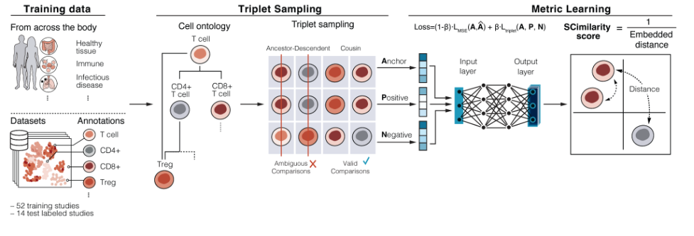

SCimilarity
================================================================================

.. toctree::
    :maxdepth: 1
    :hidden:

    Overview <self>
    Installation <install>
    Tutorials <tutorials>
    API Reference <api>
    Release Notes <news>
    About <about>

A search engine for cells
--------------------------------------------------------------------------------

SCimilarity is a unifying representation of single cell expression profiles that
quantifies similarity between expression states and generalizes to represent new
studies without additional training.

This enables a novel cell search capability, which sifts through millions of
profiles to find cells similar to a query cell state and allows researchers to
quickly and systematically leverage massive public scRNA-seq atlases to learn
about a cell state of interest.

Capabilities
--------------------------------------------------------------------------------

Cell query
^^^^^^^^^^^^^^^^^^^^^^^^^^^^^^^^^^^^^^^^^^^^^^^^^^^^^^^^^^^^^^^^^^^^^^^^^^^^^^^^

:mod:`scimilarity.cell_query` provides tools to search for similar cells
across a large reference. Input a gene expression profile of a cell state of
interest and search across tens of millions of cells to find cells that resemble
your query cell state. This does not require special preprocessing such as batch
correction or highly variable gene selection.

Cell type classification
^^^^^^^^^^^^^^^^^^^^^^^^^^^^^^^^^^^^^^^^^^^^^^^^^^^^^^^^^^^^^^^^^^^^^^^^^^^^^^^^

:mod:`scimilarity.cell_annotation` classifies cells by finding the most
similar cells in a reference catalog of 7M author annotated cells. This does not
require a user imputed reference. Users can subset the reference to cell types
of interest to increase annotation accuracy.

Model training
^^^^^^^^^^^^^^^^^^^^^^^^^^^^^^^^^^^^^^^^^^^^^^^^^^^^^^^^^^^^^^^^^^^^^^^^^^^^^^^^

:mod:`scimilarity.training_models` provides functionality to train new
SCimilarity models. User provided training datasets can be used as input to
Cell Ontology filtering, triplet sampling, and model training.

.. note::
    Model training tutorials are under construction.

And more!
^^^^^^^^^^^^^^^^^^^^^^^^^^^^^^^^^^^^^^^^^^^^^^^^^^^^^^^^^^^^^^^^^^^^^^^^^^^^^^^^
Use SCimilarity to derive new cell state signatures, compare in vivo and in
vitro conditions, or simply visualize datasets in a pre-computed common space.
With a pan-body measure of cell similarity, there are plenty of new
opportunities.

Indices
--------------------------------------------------------------------------------

| :ref:`genindex`
| :ref:`modindex`
